# AWS Getting Started

## Author

 Intellipaat

## Course url

<https://www.youtube.com/watch?v=MmsoIcYrXJU>

## Cloud computing Models

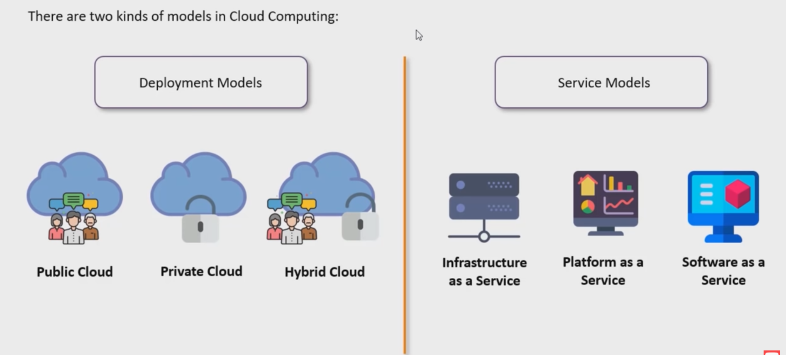

### Deployment Models

- Public Cloud - Provided over the Internet and can be bought by anyone and shared.
- Private Cloud - Provisioned over private IT infrastructure for dedicated use of a single organization.
- Hybrid Cloud - A mix of on-premises, private cloud and third-party, public cloud services with orchestration between platforms.

### Service Models

- IAAS : Infrastructure as a Service

- PAAS : Platform as a Service
  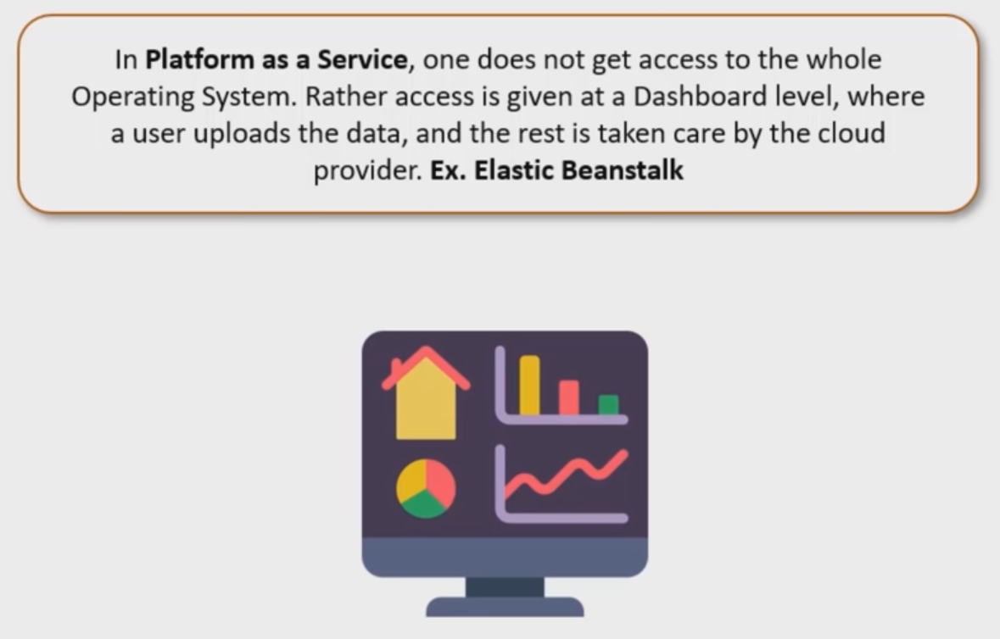

- SAAS : Software as a Service
  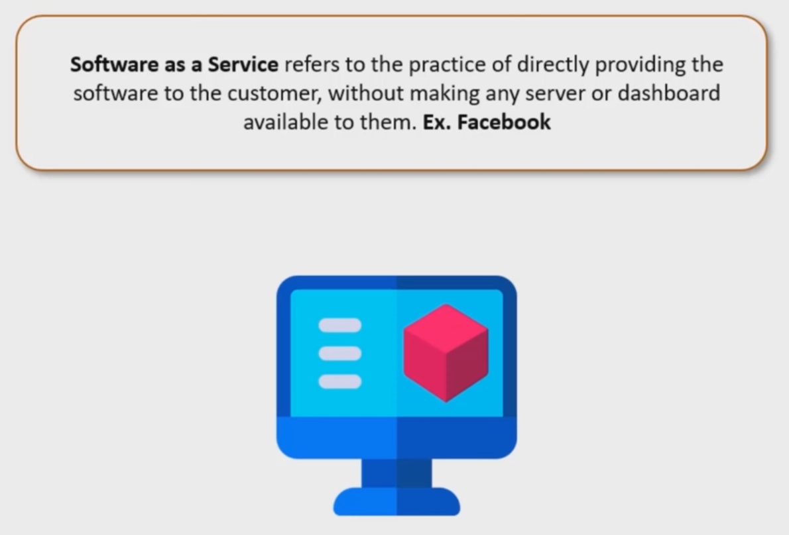

## Intro to AWS

Been in the game since 2006 and has over 35% of the cloud market share.

### Service Domains in AWS

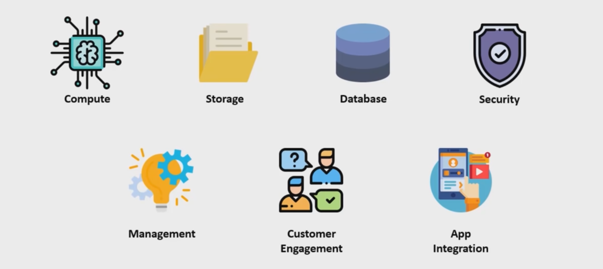

#### Compute

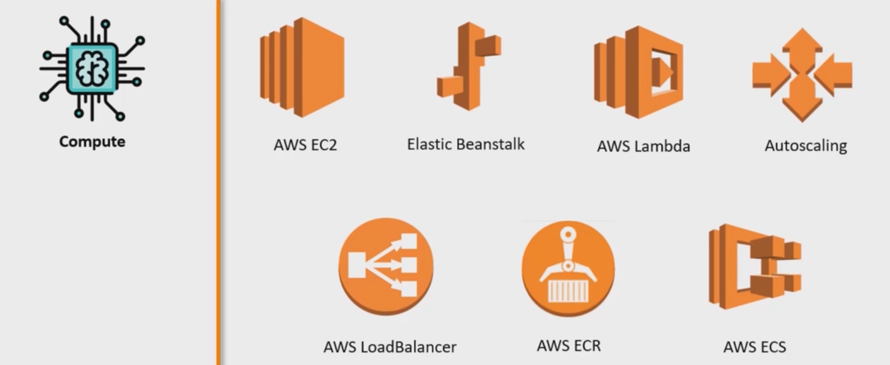

- EC2 : Elastic Compute Cloud is a raw server or an IAAS we get allowing us to configure whatever we wish to use ex: Database, web etc ...
- Elastic Beanstalk : Is an specialized version of EC2 which is a PAAS, which only allows for us to launch and run a web server/application.
  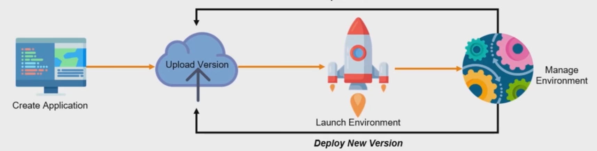
- AWS Lambda : Is another specialized version of an EC2 and is a PAAS, where we get to run backend processing on a serveless architecture
  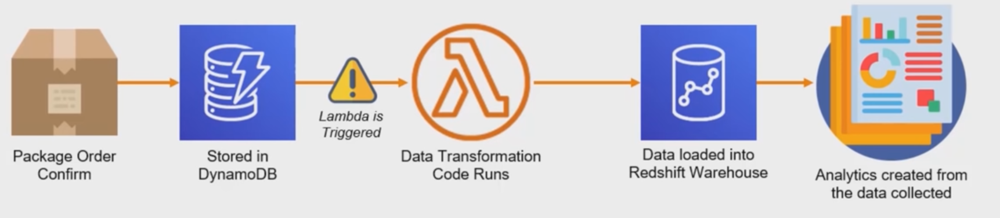
- AWS LoadBalancer : distribuutes incoming application or network traffic across multiple targets, such as Amazon EC2 instance, containers, and IP addresses, in multiple Availability Zones
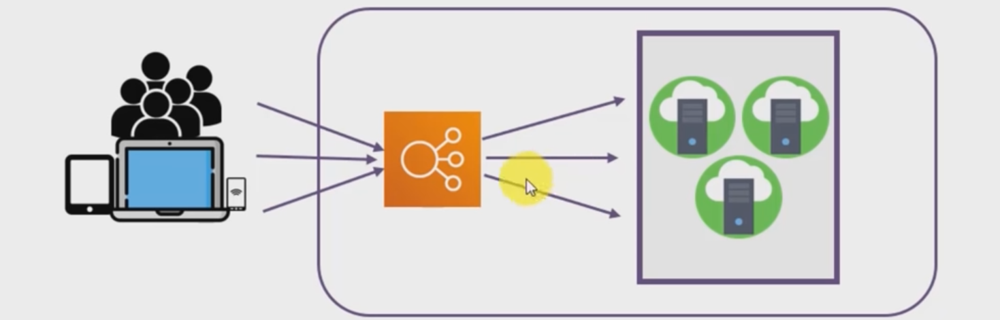
- AWS Auto Scaling : monitors your applications and automatically adjusts capacity to maintain steady, predictable performance at the lowest possible cost. It always have to work with in conjunction with the AWS loadbalancer.
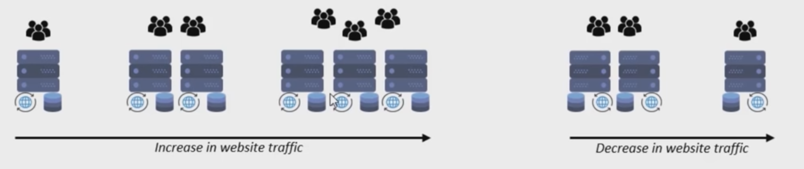
- AWS ECR : Amazon Elastic Container Registry is a fully-managed Docker container registry that makes it easy for developers to store, manage and deploy Docker container images, simillar to dockerhub.
- AWS ECS : Amazon Elastic Container Service is a higly scalable, high-performance container orchestration servie that supports Docker containers and allows you to easily run and scale containerized application on AWS.

#### Storage

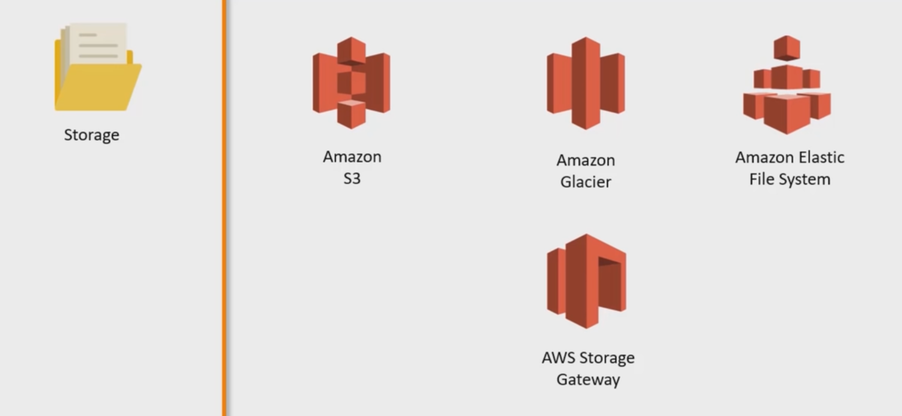

- Amazon S3 : Amazon Simple Storage Service is an object storage service that offers industry-leading scalability, data-availability, security and performance.
  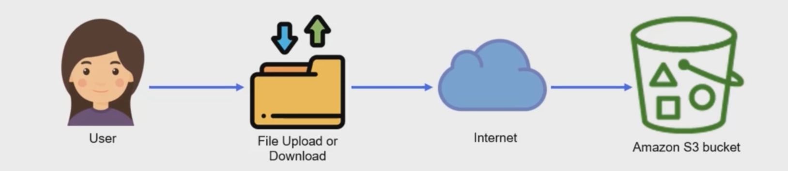
- Amazon Glacier : is a secure, durable, and extremely low-cost cloud storage service for data archiving and long-term backup. Used to take backups of S3 buckets and manage them, usually used as a backup service.
  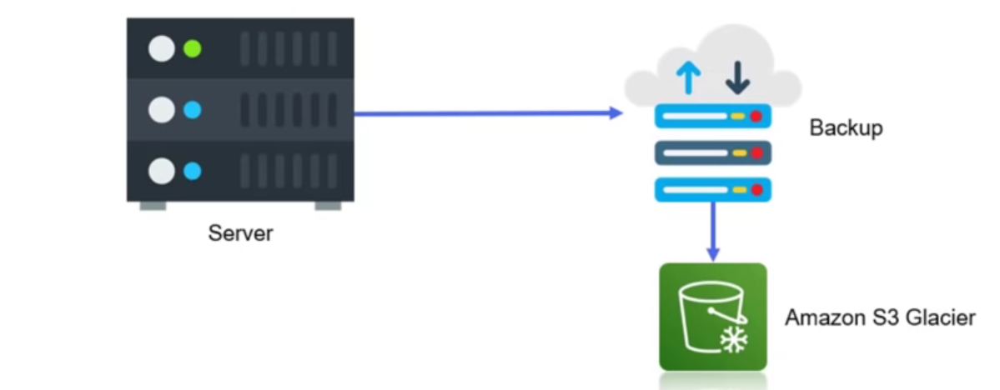
- Amazon EFS : Elastic File System is a network drive which can mount to an EC2 and handle uploads as if it were doing it on a local drive, but has the benefit or being shared and instantly available for all the other users of the app.
  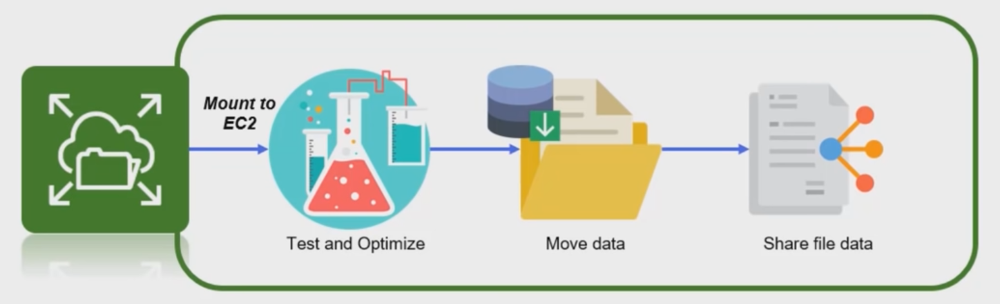
- AWS Storage Gateway : Connects on-premise software appliance with cloud based storage to provide seamless integration with data security features between your on-premise software and the AWS storage infrastructure.
  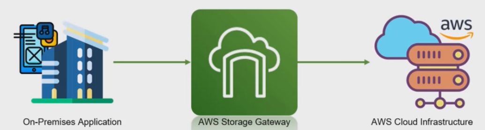

### Database

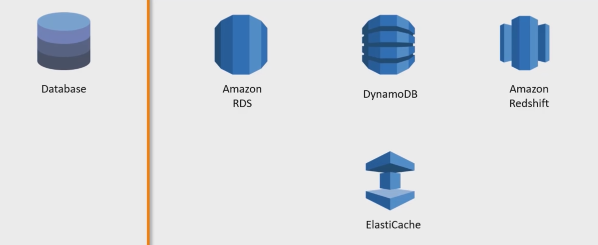

- Amazon RDS : Relation Database Service makes it easy to set up, operate, and scale a relational database in the cloud.
  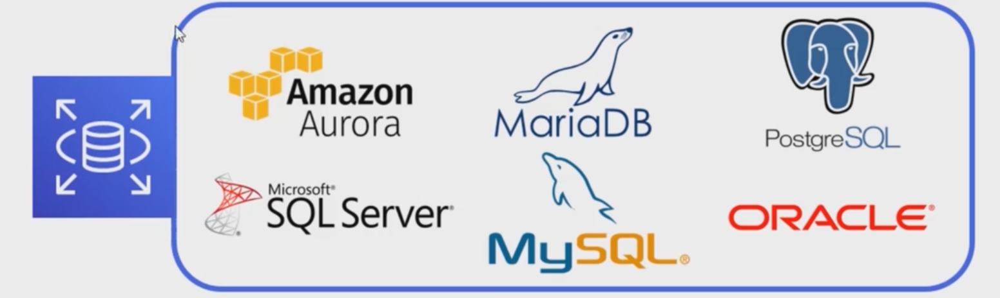
- DyamoDB : is a key-value and document database that delivers single-digit millisecond performance scale, think firebase but created by Amazon.
  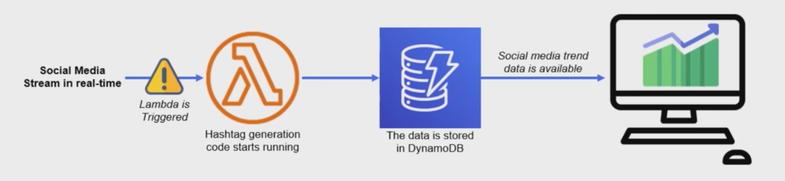
- Amazon RedShift : Is a data warehouse provided by amazon, which comprises of multiple databases and provides and interface which can be used to analyze your data warehouse and data lake.
  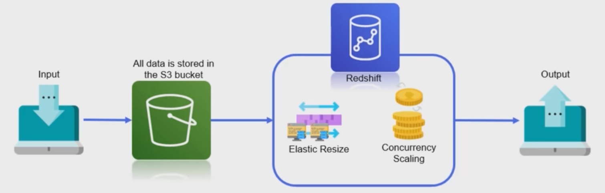
- ElastiCache : Think of something like Redis which is a cache between the server and the client
  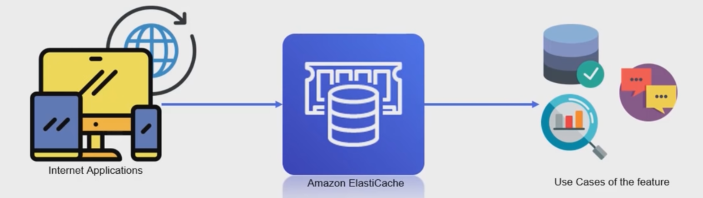

#### Security

- IAM : AWS Identity and Access Management enables you to manage access to AWS services and resources securely. This can be used to authenticate uses who will be able to configure and access the cloud servies as well as apps which will then be able to access the cloud resources like an app requiring access to the s3 bucket.
  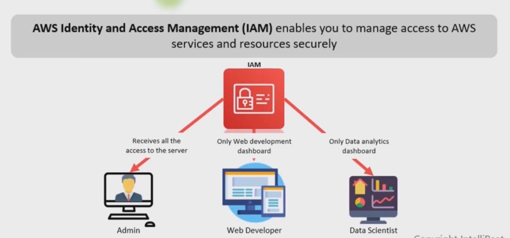

- AWS KMS : Key Management Service makes it easy for you to create and manage keys and control use of encryption across a wide range of AWS services.
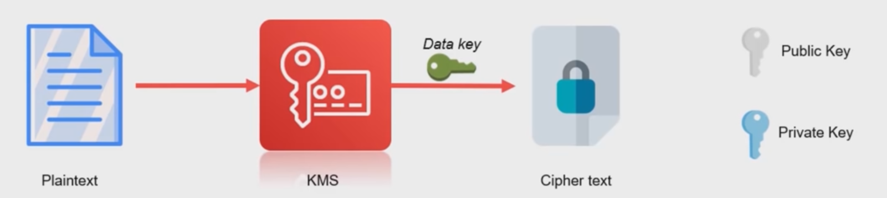

#### Management

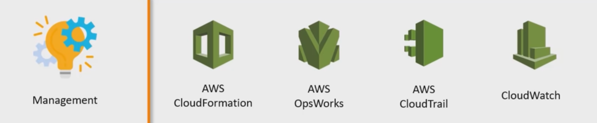

- AWS CloudFormation : provides a common language for you to describe and provision all the infrastructure resources in your cloud environment. This is bascially infrastructure as code in a gist, it is used to templatize an AWS Architecture Infrastructure like creating setting up a s3 bucket, creating a DB etc...
  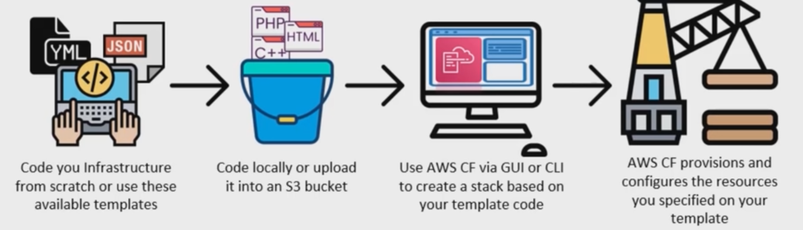
- AWS OpsWorks : is a configuration management service that provides managed instances of Chef and Puppet. Chef & Puppet are automation platforms. Think of it like Cloudformation but built in a layered style like docker using Chef and Puppet
  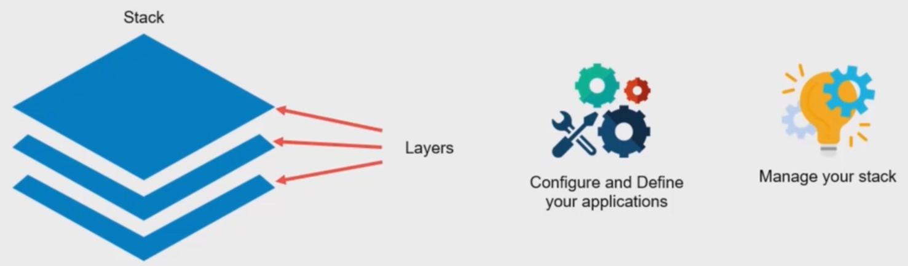
- AWS CloudTrail : is a service that enable governanance, compliance, operational auditing, and risk auditing of your AWS account. With CloudTrail, you can log continously monitor, and retain account activity related to actions your AWS infrastructure.
  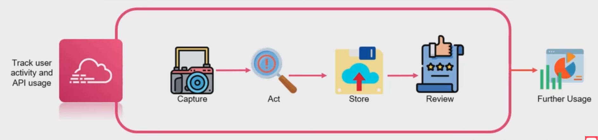
- AWS CloudWatch : is a monitoring and management service built for devs, sys ops, site reliabilty engineers to configure real time alarm on the AWS resources and act on the alarms like notifying the relevant people or creating new architecture to handle the resiliency.
  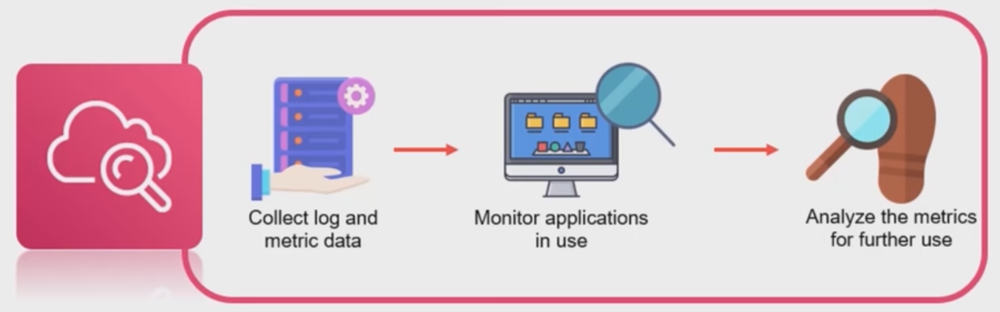

#### Customer Engagement

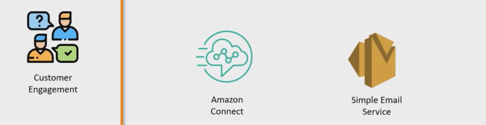

- Amazon Connect : to setup customer support for companies, it takes less than 5 minutes to get customer support.
  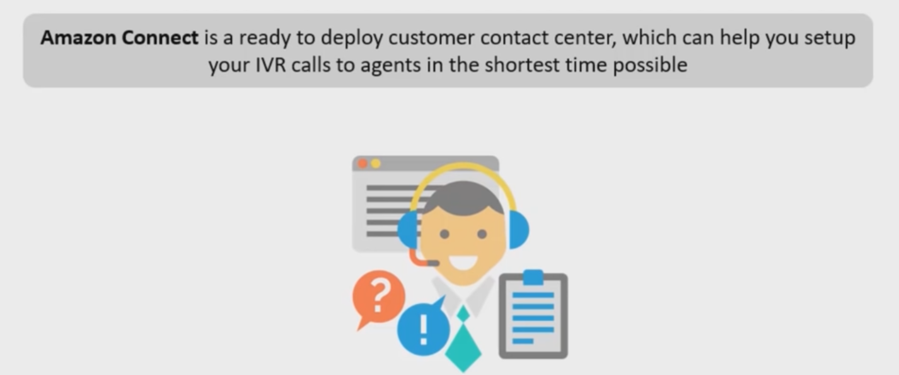
- Simple Email : is a cloud based email sending service designed to help digital marketers and app developers send markertng, notification and trasactional mails.
  

#### App Integration

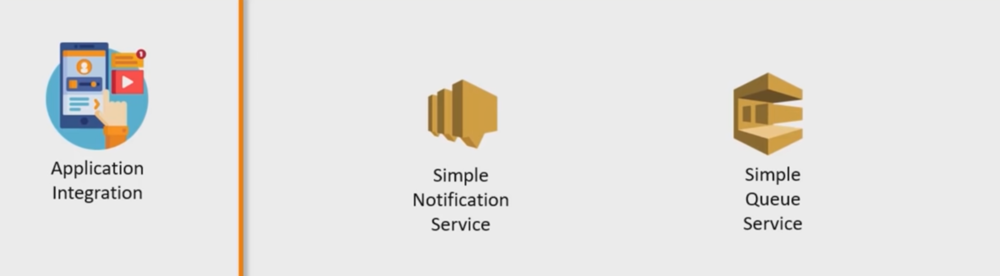

- Simple Notification Service : SNS is a highly available, durable, secure, fully managed pub/sub messaging service that enables you to decouple microservices, distributed systems and serveless apps.
  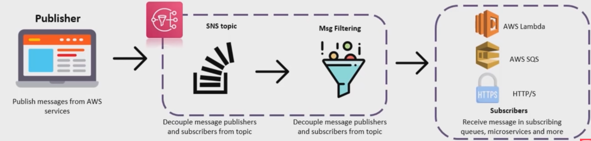
- Simple Queue Service
