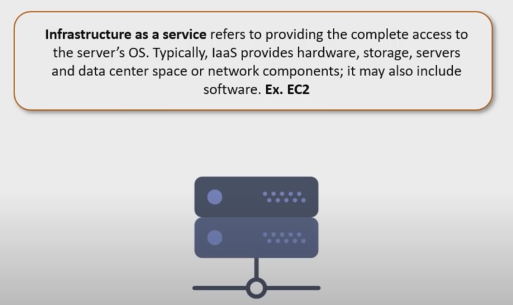

# AWS Getting Started

## Author

 Intellipaat

## Course url

<https://www.youtube.com/watch?v=MmsoIcYrXJU>

## Cloud computing Models

### Deployment Models

- Public Cloud - Provided over the Internet and can be bought by anyone and shared.
- Private Cloud - Provisioned over private IT infrastructure for dedicated use of a single organization.
- Hybrid Cloud - A mix of on-premises, private cloud and third-party, public cloud services with orchestration between platforms.

### Service Models

- IAAS : Infrastructure as a Service

- PAAS : Platform as a Service
  

- SAAS : Software as a Service
  

## Intro to AWS

Been in the game since 2006 and has over 35% of the cloud market share.

### Service Domains in AWS

#### Compute

- EC2 : Elastic Compute Cloud is a raw server or an IAAS we get allowing us to configure whatever we wish to use ex: Database, web etc ...
- Elastic Beanstalk : Is an specialized version of EC2 which is a PAAS, which only allows for us to launch and run a web server/application.
  
- AWS Lambda : Is another specialized version of an EC2 and is a PAAS, where we get to run backend processing on a serveless architecture
  
- AWS LoadBalancer : distribuutes incoming application or network traffic across multiple targets, such as Amazon EC2 instance, containers, and IP addresses, in multiple Availability Zones

#### Storage

#### Security

#### Management

#### Customer Engagement

#### App Integration

