# Getting Started with Apache Kafka

## Author

Ryan Plant

## Course url

<https://app.pluralsight.com/library/courses/apache-kafka-getting-started/table-of-contents>

## Getting started with Apache Kafka

Kafka means Basically a nightmarish situation


### Enterprise Challenges with Data

As large scale enterprise application grows, they create a lot of data that needs to be shared from different sources like in the image given below for different use cases.


These issues can be solved in a lot of different ways, some of which are

- Database replication
  - Supports only RDBMS only
  - Replication support is vendor dependent, so you can forget about cross vendor support
  - Tight coupling of (schema) has ripple effects on the replication stratergy
  - Cumbersome
- Log Shipping
  - Performance challenges depending on the size of the log
  - Cumbersome
- [ETL (Extract, Transform & Load)](<https://www.guru99.com/etl-extract-load-process.html>)
    > ETL is a process that extracts the data from different source systems, then transforms the data (like applying calculations, concatenations, etc.) and finally loads the data into the Data Warehouse system. Full form of ETL is Extract, Transform and Load.
    > It's tempting to think a creating a Data warehouse is simply extracting data from multiple sources and loading into database of a Data warehouse. This is far from the truth and requires a complex ETL process. The ETL process requires active inputs from various stakeholders including developers, analysts, testers, top executives and is technically challenging.
    >In order to maintain its value as a tool for decision-makers, Data warehouse system needs to change with business changes. ETL is a recurring activity (daily, weekly, monthly) of a Data warehouse system and needs to be agile, automated, and well documented.

  - Typically proprietary and costly
  - Lots of custom development, so the solution is not really portable
  - Scalability challenged
  - Performance Challenged
  - Often time require multiple instances
- Messaging
- Custom middleware magic
  
  - Custom middleware written to integrate different applications using either REST, or different data stores etc ..., this requires extensive knowledge of each data model. We will also have to distrubuted cordination logic and get out of easily the more distrubuted the system gets.

### Messaging Limitations and Challenges

- Limited scalability as scalability depends on the scalability of the message broker
- Smaller messages as larger messages can put strain on the message service
- Requires rapid consumption, apps should keep up with messages being published or else it might strain the message broker which can introduce a DDOS attack on itself
- Not fault-tolerant(application) as once the message is delivered/consumed by an application it is lost forever


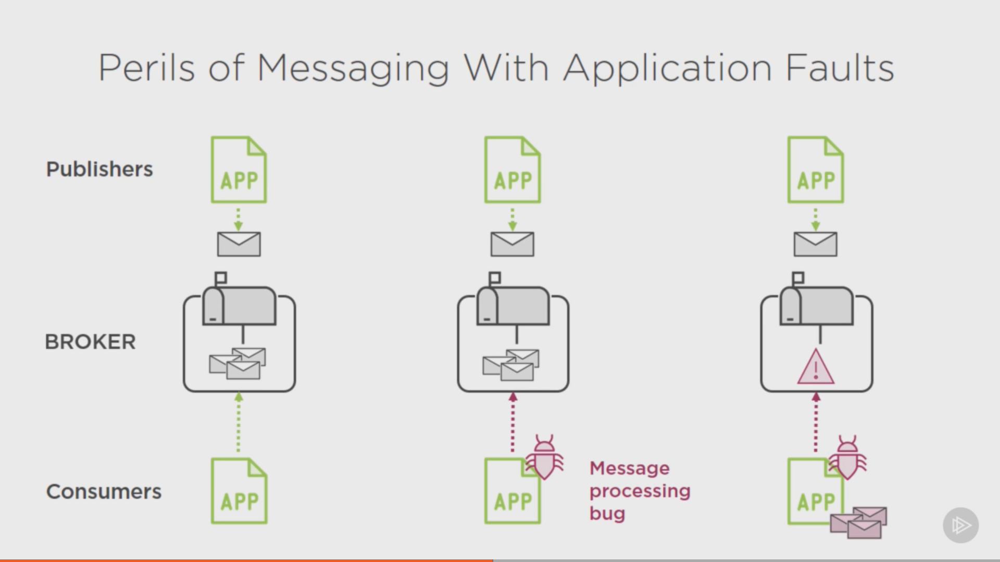


### A Use case with linkedin

Isn't there a better way to move data around :

- Cleanly
- Reliably
- Quickly
- Autonomously


### Apache Kafka as a viable solution

When linkedin created Apache Kafka, they had the following goals in mind

- The message bus should support high throughput
- The message bus should be horizontally scalable unlike old messaging systems
- The messages should be delivered in a reliable and durable manner, in the case of a failure from the consumer end, the message could be recoverable
- Loosely coupled between producers and consumers so no one is dependent on another and adding or removing producers will not bring down other consumers
- Flexible pub-sub semantics, independent data producing apps would send on a topic and consumers could receive those messages by subscribing to those topics


## Getting to know Apache Kafka's Architecture

Main components of the Apache Kafka eco system

- Producers : Send messages to a specific topic
- Consumers : subscirbe to a specific topic and retrieve them when new messages arrive
- Brokers : The place where kafka keeps and maintains topics is called the broker, which is an exe that runs a dameon service, a.k.a server, it stores the topics in the file system. The Kafka broker is what differentiates kafka from other messaging systems
- Topics : Are addresses to which producers post messages to from which consumers can retrieve them


- Cluster : A Kafka cluster is a grouping of multiple Kafka brokers, a Kafka cluster can be created by clustering multiple instance of Kafka brokers running in a single physical machine or across multiple physical machines as long as they share the same grouping


### Distributed Systems


A distribute node to ensure that due process is followed to achive the common goal it achieves, elects a Controller which is also a worker node to handle the administrative functions like

- Inventory of the workers available to take on work
- Maintain a list of work items that have been commited to and assigned to workers
- To maintain active status of the workers and their progress

#### Achieving Reliability in DS like Apache Kafka


How reliability is achived through redundancy


#### Distributed Systems : Communicaion and Consensus

A DS needs communication and consensus between them to function namely on


To achieve this in Apache kafka we use


## Understanding Topics, Partitions, and Brokers

### Apache Kafka Topics

- Central Kafka Abstraction
- Named feed or category of messages
  - Producers produce
  - Consumers consume
- Logical entity
- By are physically represented in a log

Message asbtraction if Kafka
 

### Event Sourcing

An architecture style or approach to maintaining an application's state by capturing all  changes as a sequence of time-ordered, immutable events

Zoomed in view of a Message producer


When a producer produces an event, it appends the mesage to a time ordered sequence, the events are immutable, if a produces produces an incorrect message, then it cannot modify the existing message, it can only publish a new message and the onus falls upon the consumer to reconcile this.

### What a Kafka message content looks like


### The Message Offset and Retention Policy

#### The Offset

Is a placeholder for

- The last read message position, think of it like a bookmar in the message queue
- is Maintained by the Kafka Consumer, so each consumer work at its own pace
- The last read position corresponds to the messsage Identifier


#### Message Retention Policy

- Apache kafka retains all published messages regardless of consumption
- The rentention period is configurable
  - Defaults to 168 hours, then the messages starts falling off starting from the oldest
- Retention period is defined on a per-topic basis
- Physical storage resources can constrain message retention

#### Apache Kafka as a distrubted commit log


Apache Kafka at its core is a ditributed commit log, a raw database, which
uses Pub/Sub semantices to communicate between consumer and producer. In RDBMS
the log files are nothing but a list of transaction logs which can be replayed to rebuild the database, like backups or replication stratergies.

#### Kafka Partitions


In genera, the scalability of Apache kafka is determined by the number of partitions being managed by multiple broker nodes


How Zookeeper handles request to create multiple partitions

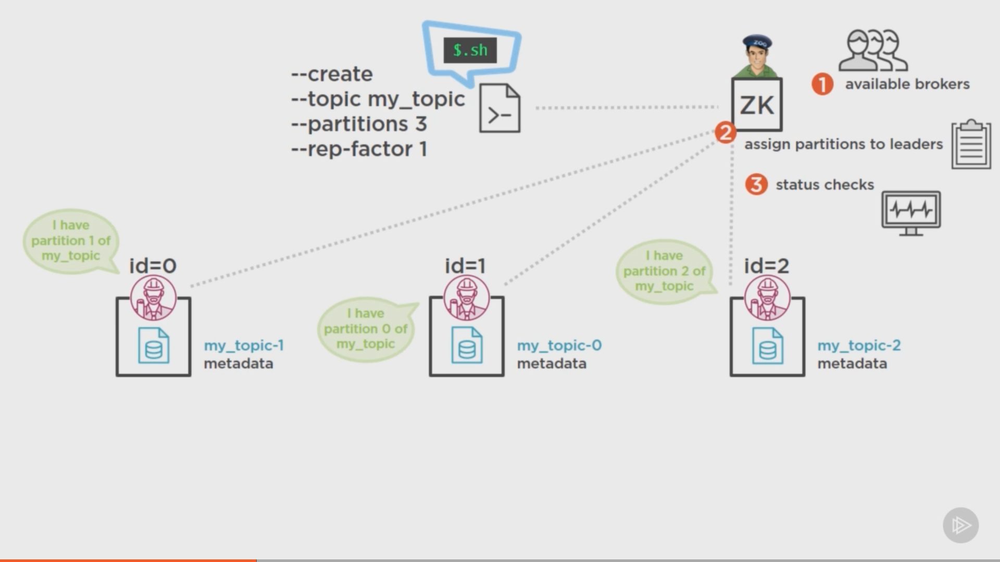

A Producer needs to know about atleast one broker in the clusterso it can find the leaders of the topic partitions. Each broker knows which partitions are owned by which leaders and sends this meta data about the topic to the producer when then can send messages to all the leaders in the cluster to different partitions


This is a bit tricky, the consumer checks with Zookeeper about the brokers and their respective partitions which make up the topics, it will then pull the messages from these partitions based on the message offset per partition, because messages are produced to multiple partitions and at different times, consumers working with multiple partitions will likely consume messages at different orders and will therefore be responsible for handling the order if it is required


#### Partitioning Trade-offs

- The more partiions the greater the Zookeeper overhead, as it is the lynchpin which provides all the
  meta information about the broker cluster and the relevant partitions they have, so the more partitions,
  the more entires it needs to maintain and can become resoruce constrained very quickly
  - Ensure that large partition numbers ensure proper ZK capacity
- Message ordering can become complex, since Kafka messages are time-ordered, maintiainin a global order is a must to
  prevent conflicts
  - Single partition for global ordering, however this again brings back the issue of scalability
  - Another way to handle this is consumer-handling for  ordering, where the consumer handles the ordering across the
    partitions
- The more partitions the longer the leader fail-over time

#### Achiveving Reliability with Apache Kafka Replication (Fault Tolerence)

How can we work our way across failures in brokers ?
In the event of a broker failing, ZK relegates the responsibilty of the the failed brokers partion to another
available borker in the cluster and updates the metadata for the other brokers, producer and consumers. However the
problem is that there is no way to recover the lost brokers messages as there is no redundancy between nodes

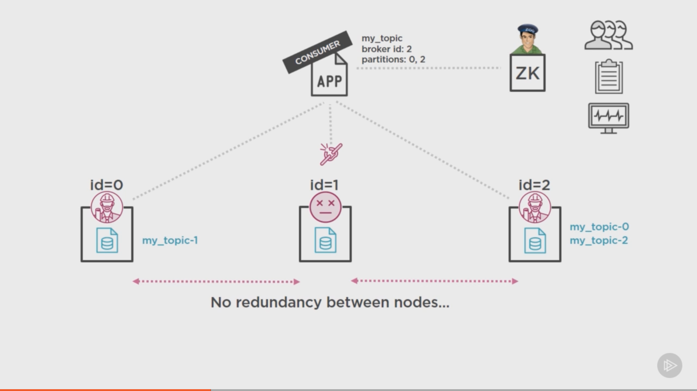

```cmd
bin/kafka-topics.sh --create --topic my_topic \
--zookeeper localhost:2191 \
--partitions 3 \
--replication-factor 1 \\Adds fault tolerence between nodes
```

#### Replication Factor

- Reliable work distribution
  - Redundancy of messages
  - Cluster resiliency
  - Fault-tolerance
- Gurantees
  - N-1 broker failure
  - 2 or 3 minumum replication factor
- Configured on a per-topic-basis

Multiple Replica Sets

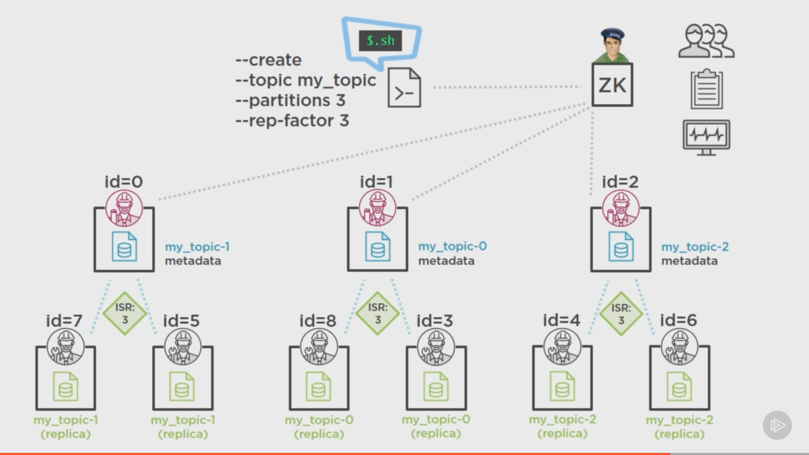

ISR is the kye metric here, it stands for In Sync Replicas

```cmd
bin/kafka-topics.sh --create --topic my_topic \
--zookeeper localhost:2191 \
--partitions 3 \
--replication-factor 3 \\Adds fault tolerence between nodes
```

In the event the ISR for a given quorum falls below the configured replica ISR, Kafka does not automatically tries to add new peers to the failing quorum, hence constant and vigilant monitoring is the key here

Viewing Topic State

```cmd
bin/kafka-topics.sh --describe --topic my_topic \
--zookeeper localhost:2191 \
```

## Producing Messages with Kafka Producers

### Kafka Producer Internals

The complete Kafka producer internals diagram

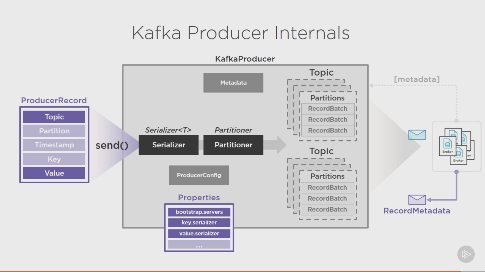

1. Creating a Kafka producer

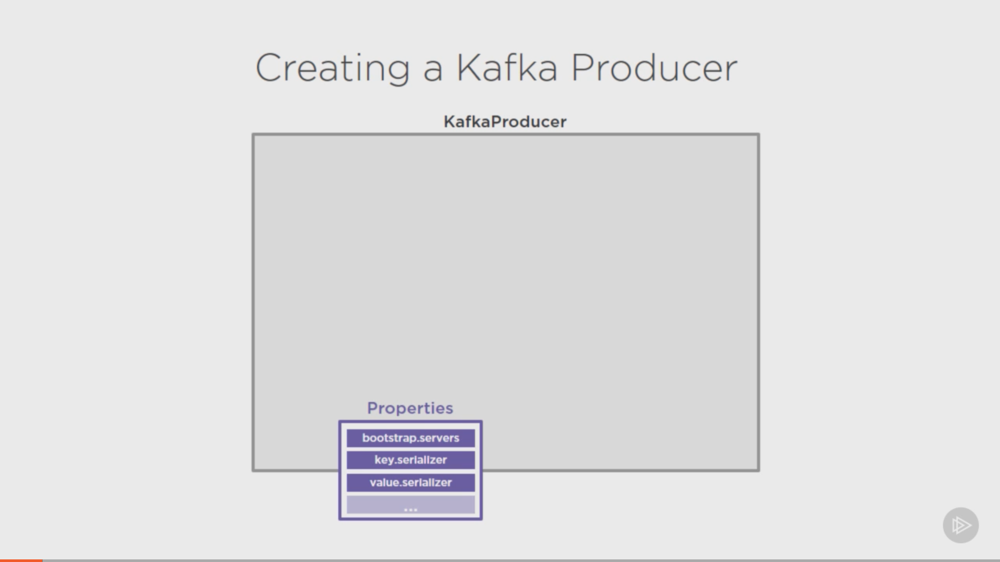

```java

final Properties properties = new Properties();

properties.put("boostrap.servers", "BROKER-1:9092, BROKER-1:9093");
properties.put("key.serializer", "org.apache.kafka.common.serialization.StringSerializer");
properties.put("value.serializer", "org.apache.kafka.common.serialization.StringSerializer");

final KafkaProducer<String, String> myProducer = new KafkaProducer<>(properties);

```

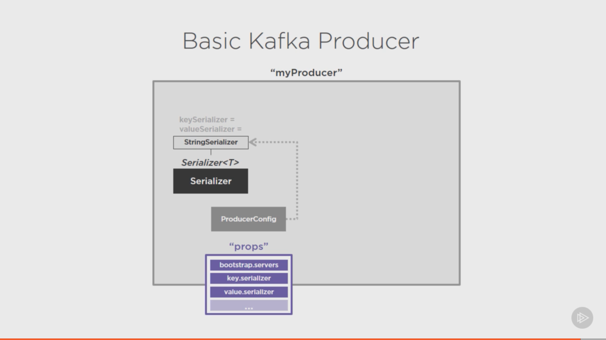

Kafka does not produce messages, it produces records which are sent as messages
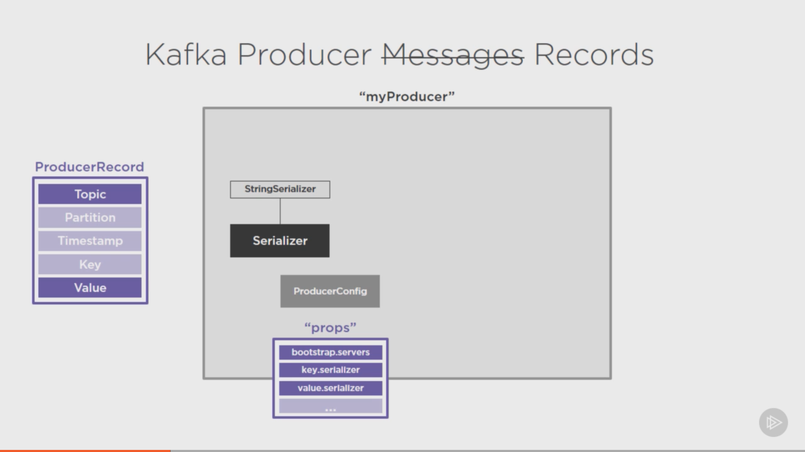

```java
final ProducerRecord<String, String> record = new ProducerRecord<>("my_topic", "My Message 1");

myProducer.send(record, (recordMetadata, e) -> {
  //Handle callback on message sent
});

```

**Kafka Producer instances can only send ProducerRecords that match the key and value
serializers types it is configured with**

The Key best practice

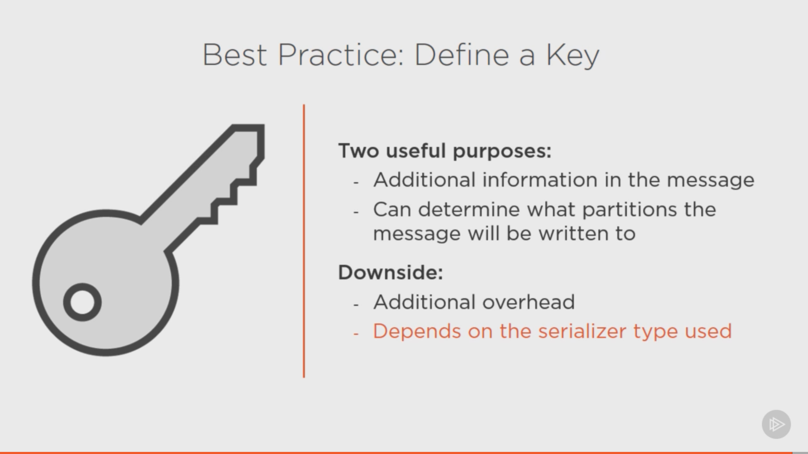

#### Sending the Message, Part 1

When the producer sends a record, the bootstrap.servers is used to ping the available brokers, which then
send out a Metadata object which contains information about the topics, their partition and managing brokers, and throughtout the lifecycle of the producer this Metadata object is constantly updated.


After receiving the meta data, the producer establishes a pseudo pipleine which parses the message with the configured serializer, the next step in the pipeline is the partitioner whose job is to determine which partition to send the record to, the producer can employ different stratergies to determine this information and send it in the ProducerRecord


#### kafka Proudcer Partioning Stratergy

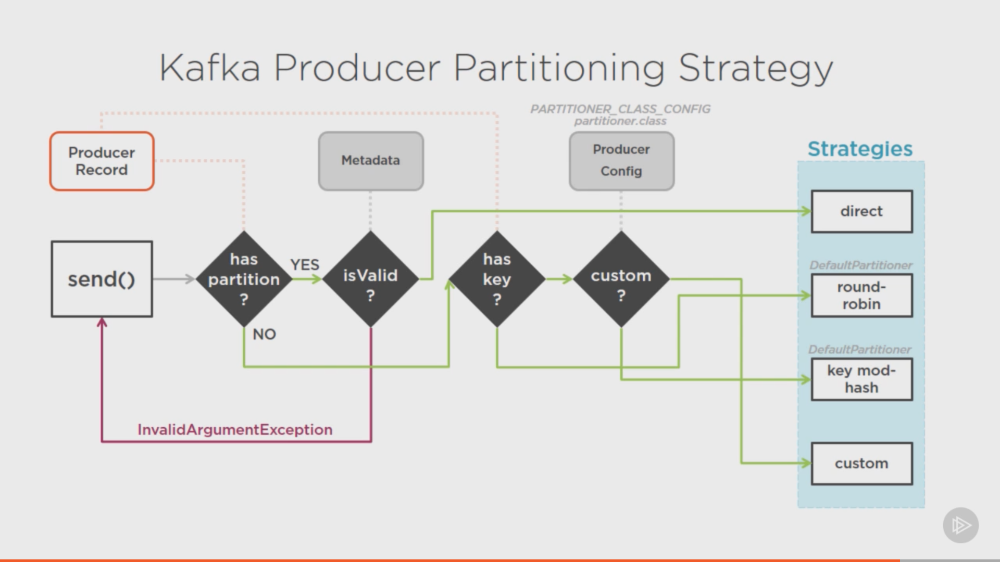

#### Sending the Message, Part 2

Micro-batching in Apache kafka

- At scale, efficiency is everything
- Small, fast batches of messages:
  - Sending (Producer)
  - Writing (Broker)
  - Reading (Consumer)
- Modern operating system functions
  - Pagecache
  - Linux sendFile() system call (kernal)
- Amortization of the constant cost

RecordAccumulator gives the produer the ability to micro-batch the records intended to be sent in high frequency and volumes


Message Buffering

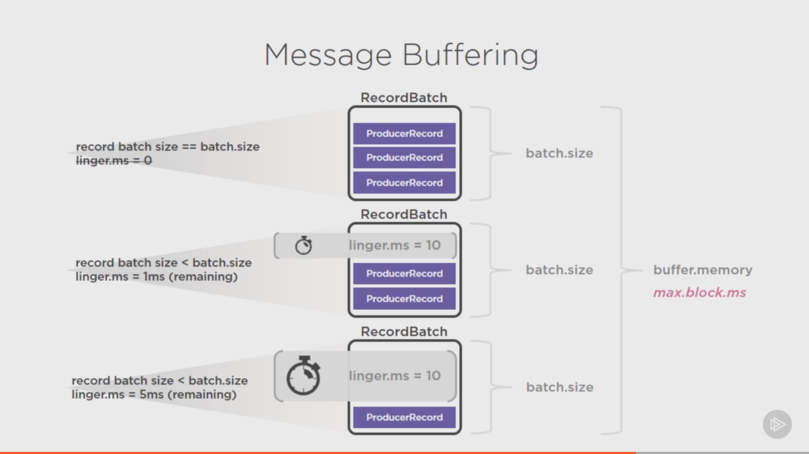


#### Delivery Gurantees

- Broker acknowledement ("acks")
  - 0: fire and forget, less reliable since the producer has no way of knowing if the message has been sent, but is the fastest
  - 1: leader acknowledged , only the leader responds with an acknowledgement, not the replicas, sweet spot for performance and reliability
  - 2: replication quorum acknowledged, all the ISR's respond with acknowledgement, highest reliability also the slowest
- Broker responds with error
  - "retiries"
  - "retry.backoff.ms"

#### Ordering Gurantees

- Message order by partition
  - No global order across partitions
- Can get complicated with errors
  - retries, retry.backoff.ms
  - max.in.flight.request.per.connection : at any given moment there can only be one message in-flight
- Delivery semantics
  - At-most-once, at-least-once, only-once

## Consuming Messages with Kafka Consumers and Consumer Groups

## Exploring the Kafka Ecosystem and Its Future
