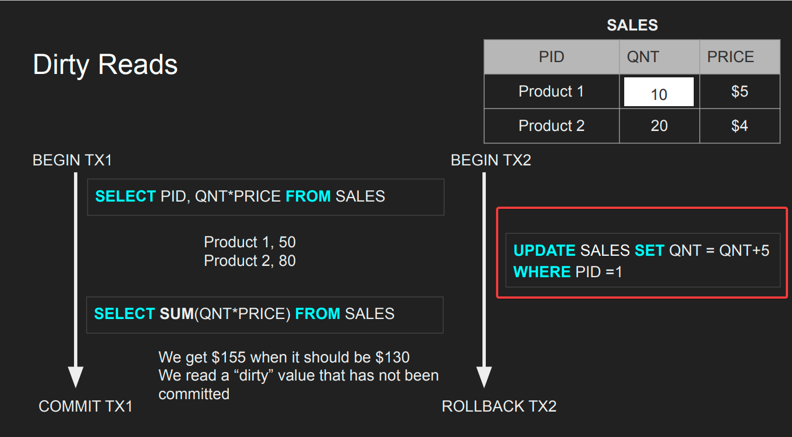
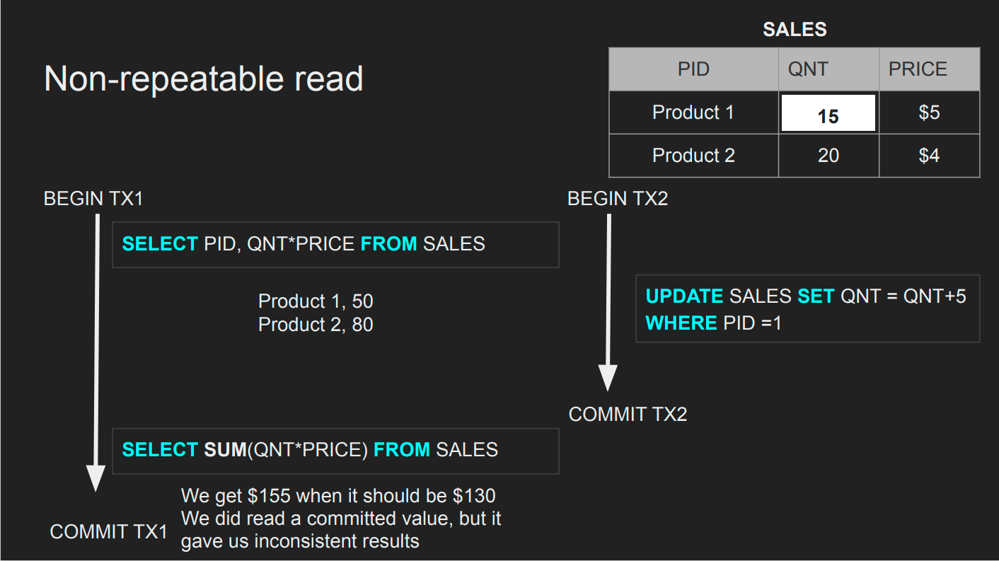
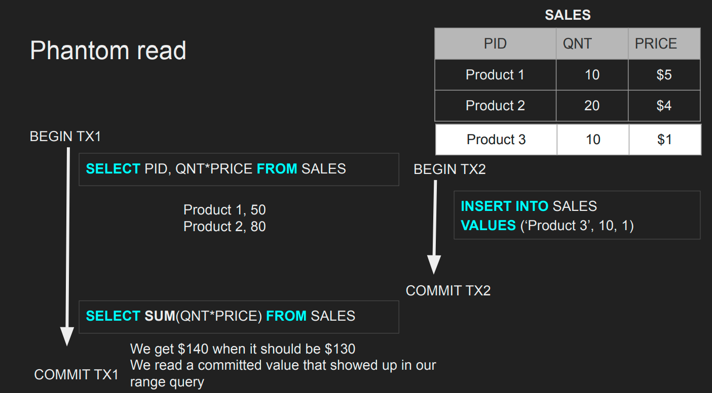
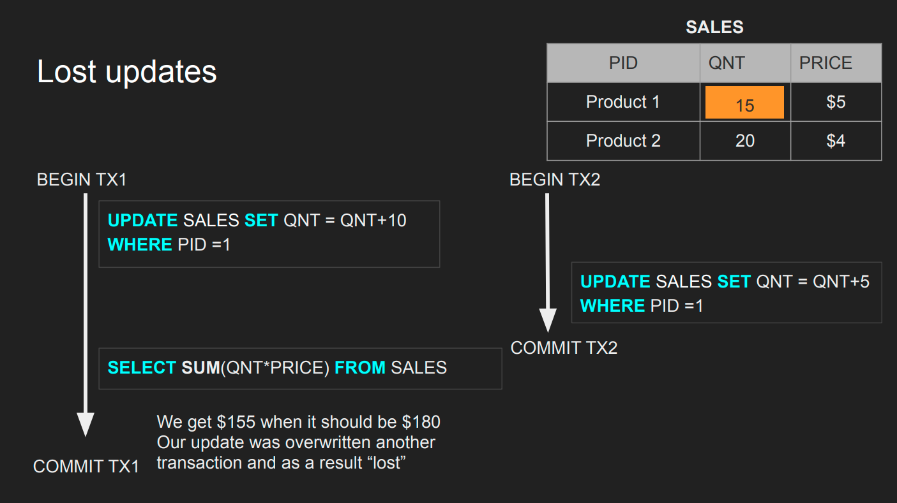
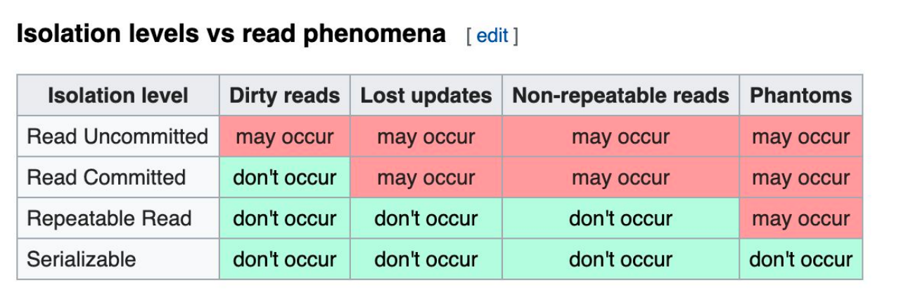

# ACID

Extracted from the udemy course of Hussain Nasser [Database engineering crash course](https://www.udemy.com/course/database-engines-crash-course/).

Stands for in relation to database transactions as :

**A** - Atomicity
**C** - Consistency
**I** - Isolation
**D** - Durability

## Atomocity

All transactions should be about all or nothing, if there is even a single query failure the transaction should be rolled back.

- All queries in a transaction must succeed.
- If one query fails, all prior successful queries in the transaction should rollback.
- If the database went down prior to a commit of a transaction,
all the successful queries in the transactions should rollback

## Isolation

Can my inflight transaction see changes made by other
transactions whether they are commited or not?

### Isolation - Read phenomena

- **Dirty reads** : When the current inflight transactions reads and information from other concurrently occuring inflight transactions.

- **Non-repeatable reads** : When the current inflight transactions reads information which was later **updated** from another commited transaction which happened concurrently but finished earlier than the transaction interested transaction.
_This only applies if the row a select or a vairation of it ran earlier, else this is ignored_.Fixing this is expensive.Postgres does this by default, MySQL does not

- **Phantom reads** : When the current inflight transactions reads information which was comes up in a range query which was not avaiable when the current transaction started, but was **inserted** by another commited transaction which happened concurrently but finished earlier than the transaction interested transaction.

- **Lost updates** : When two inflight transactions update the same row and one transactions update is lost in the process, leads to data integrity issues. Could be solved by locking mechanisims.

### Isolation Levels

Are used to set the isolation levels in a transaction.

- **Read uncommitted** - No Isolation, any change from the outside is visible to the transaction, committed or not.
- **Read committed** - Each query in a transaction only sees committed changes by other transactions
- **Repeatable Read** - The transaction will make sure that when a query reads a row, that row will remain unchanged while its running. Only applicable if the row was read earlier.
- **Snapshot** - Each query in a transaction only sees changes that have been committed up to the start of the transaction. It's like a snapshot version of the database at that moment. This ensures that the transaction works with only the changes it signed up for, and does not consider anything other read phenomeas.
- **Serializable** - Transactions are run as if they serialized one after the other. Forget about the transaction concurreny, the db tries to answer which goes first and very slow.
- _Each DBMS implements Isolation level differently_

### Isolation Levels vs read phenomena

### Database Implementation of Isolation

Each DBMS implements Isolation level differently

- Pessimistic - Row level locks, table locks, page locks to avoid lost updates
- Optimistic - No locks, just track if things changed and fail the transaction if so
- Repeatable read “locks” the rows it reads but it could be expensive if you read a lot of rows, postgres implements RR as snapshot. That is why you don’t get phantom reads with postgres in repeatable read
- Serializable are usually implemented with optimistic concurrency control, you can implement it pessimistically with SELECT FOR UPDATE

## Consistency

- Consistency in Data : Ensures that all data is consistent in disk when it is normalized, so all foreign keys point to values which ara avilable, indexes are available for columns which are present.
  - Defined by the User
  - Referential Integrity (foreign keys)
  - Atomicity ensures that there is consistency in data
  - Isolation ensures consistency in data
- Consistency in reads
Ensuring the consistency that reads should yeild the result which was a result of latest write to that database, even though this looks like a given, problems start happening, when there is replication, sharding in place.
  - If a transaction committed a change will a new transaction
immediately see the change?
  - Affects the system as a whole
  - Relational and NoSQL databases suffer from this
  - Eventual consistency

### Eventual Consistency

Even though there would could be inconsistencies in the data, over time the database would heal to ensure consistency,
this is not the same as a referential integrity issue or data corruption.

## Durability

Changes made by committed transactions must be persisted in a durable non-volatile storage. Even though this looks like a given, database engines can play around this with to show perceived performance during writes, like writing to a volatile storage(fast but temporary) and sync in the background to the involatile storage(slow and permanent). Redis does this.

The Durability techniques

- WAL - Write ahead log
  Write to a log instead of the actual table storage, so we achieve durability in the event of a db crash and can achieve eventual consistency and durability by rebuilding the storeage using the logs.
- Asynchronous snapshot
- AOF

### Durability - WAL

Writing a lot of data to disk is expensive (indexes, data
files, columns, rows, etc..). That is why DBMSs persist a compressed version of the changes known as WAL (write-ahead-log segments).

Note : _Problems might be introduced because of the OS Cache_

- A write request in OS usually goes to the OS cache
- When the writes go the OS cache, an OS crash, machine
restart could lead to loss of data
- Fsync OS command forces writes to always go to disk which can be expensive and slows down commits

## Slides

- [ACID PDF](assets/ACID.pdf)
