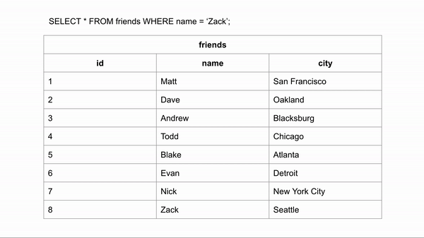

# Indexing

Indexes pinpoint to the exact place in disk where an information is, this is much faster to search than going through each block and finding that information. This optimizes the search of this information where now the search has to just narrow the right bucket, rather than do a scan of the entire information.

## Database Indexing

Table scanning in databases is usually slow, so indexes are needed to avoid scans and speed up the processes, indexes are not the silver bullet for database performance, they come at a cost of space and memory, having too many indexes can be counter productive.

When data is stored on disk-based storage devices, it is stored as blocks of data. These blocks are accessed in their entirety, making them the atomic disk access operation. Disk blocks are structured in much the same way as linked lists; both contain a section for data, a pointer to the location of the next node (or block), and both need not be stored contiguously.

> Imagine you want to find a piece of information that is within a large database. To get this information out of the database the computer will look through every row until it finds it. If the data you are looking for is towards the very end, this query would take a long time to run.

Visualization for finding the last entry:

>If the table was ordered alphabetically, searching for a name could happen a lot faster because we could skip looking for the data in certain rows. If we wanted to search for “Zack” and we know the data is in alphabetical order we could jump down to halfway through the data to see if Zack comes before or after that row. We could then half the remaining rows and make the same comparison.

Indexes allow us to create sorted lists without having to create all new sorted tables, which would take up a lot of storage space.

Due to the fact that a number of records can only be sorted on one field, we can state that searching on a field that isn’t sorted requires a Linear Search which requires (N+1)/2 block accesses (on average), where N is the number of blocks that the table spans. If that field is a non-key field (i.e. doesn’t contain unique entries) then the entire tablespace must be searched at N block accesses.

Whereas with a sorted field, a Binary Search may be used, which has log2 N block accesses. Also since the data is sorted given a non-key field, the rest of the table doesn’t need to be searched for duplicate values, once a higher value is found. Thus the performance increase is substantial.

### What is indexing?

An index is a structure that holds the field the index is sorting and a pointer from each record to their corresponding record in the original table where the data is actually stored.

Indexing is a way of sorting a number of records on multiple fields. Creating an index on a field in a table creates another data structure which holds the field value, and a pointer to the record it relates to. This index structure is then sorted, allowing Binary Searches to be performed on it.

### Types of Indexing

There are two types of databases indexes:

1. **Clustered**
  Indexes are the unique index per table that uses the primary key to organize the data that is within the table. The clustered index ensures that the primary key is stored in increasing order, which is also the order the table holds in memory.
    - Clustered indexes do not have to be explicitly declared.
    - Created when the table is created.
    - Use the primary key sorted in ascending order.

    _However, in order to search for the “name” or “city” in the table, we would have to look at every entry because these columns do not have an index. This is where non-clustered indexes become very useful._
2. **Non-clustered**
  Indexes are sorted references for a specific field, from the main table, that hold pointers back to the original entries of the table. The first example we showed is an example of a non-clustered table.
  _Note: Non-clustered indexes are not new tables. Non-clustered indexes hold the field that they are responsible for sorting and a pointer from each of those entries back to the full entry in the table._
  Non-clustered indexes point to diskblock addresses instead of storing data themselves. This makes them slower to query than clustered indexes but typically much faster than a non-indexed column.

Both clustered and non-clustered indexes are stored and searched as B-trees, a data structure similar to a binary tree. A B-tree is a
>“self-balancing tree data structure that maintains sorted data and allows searches, sequential access, insertions, and deletions in logarithmic time.”

Basically it creates a tree-like structure that sorts data for quick searching.

Here is a B-tree of the index we created. Our smallest entry is the leftmost entry and our largest is the rightmost entry. All queries would start at the top node and work their way down the tree, if the target entry is less than the current node the left path is followed, if greater the right path is followed. In our case it checked against Matt, then Todd, and then Zack.

To increase efficiency, many B-trees will limit the number of characters you can enter into an entry. The B-tree will do this on it’s own and does not require column data to be restricted. In the example above the B-tree below limits entries to 4 characters.

### How does it work?

Firstly, let’s outline a sample database table schema;

Field name | Data type | Size on disk
-----------|-----------|-------------
id (Primary key) Unsigned INT | 4 bytes
firstName | Char(50) | 50 bytes
lastName | Char(50) | 50 bytes

*Note*: char was used in place of varchar to allow for an accurate size on disk value. This sample database contains five million rows and is unindexed. The performance of several queries will now be analyzed. These are a query using the id (a sorted key field) and one using the firstName (a non-key unsorted field).

### Example 1 - sorted vs unsorted fields

Given our sample database of r = 5,000,000 records of a fixed size giving a record length of R = 204 bytes and they are stored in a table using the MyISAM engine which is using the default block size B = 1,024 bytes. The blocking factor of the table would be bfr = (B/R) = 1024/204 = 5 records per disk block. The total number of blocks required to hold the table is `N = (r/bfr) = 5000000/5 = 1,000,000 blocks`.

A linear search on the id field would require an average of N/2 = 500,000 block accesses to find a value, given that the id field is a key field. But since the id field is also sorted, a binary search can be conducted requiring an average of log2 1000000 = 19.93 = 20 block accesses. Instantly we can see this is a drastic improvement.

Now the firstName field is neither sorted nor a key field, so a binary search is impossible, nor are the values unique, and thus the table will require searching to the end for an exact N = 1,000,000 block accesses. It is this situation that indexing aims to correct.

Given that an index record contains only the indexed field and a pointer to the original record, it stands to reason that it will be smaller than the multi-field record that it points to. So the index itself requires fewer disk blocks than the original table, which therefore requires fewer block accesses to iterate through. The schema for an index on the firstName field is outlined below;

Field name | Data type | Size on disk
-----------|-----------|-------------
firstName | Char(50) | 50 bytes
(record pointer) Special | 4 bytes

_Note: Pointers in MySQL are 2, 3, 4 or 5 bytes in length depending on the size of the table_.

### Example 2 - indexing

Given our sample database of r = 5,000,000 records with an index record length of R = 54 bytes and using the default block size B = 1,024 bytes. The blocking factor of the index would be bfr = (B/R) = 1024/54 = 18 records per disk block. The total number of blocks required to hold the index is N = (r/bfr) = 5000000/18 = 277,778 blocks.

Now a search using the firstName field can utilize the index to increase performance. This allows for a binary search of the index with an average of log2 277778 = 18.08 = 19 block accesses. To find the address of the actual record, which requires a further block access to read, bringing the total to 19 + 1 = 20 block accesses, a far cry from the 1,000,000 block accesses required to find a firstName match in the non-indexed table.

### When should it be used?

Given that creating an index requires additional disk space (277,778 blocks extra from the above example, a ~28% increase), and that too many indices can cause issues arising from the file systems size limits, careful thought must be used to select the correct fields to index.

Since indices are only used to speed up the searching for a matching field within the records, it stands to reason that indexing fields used only for output would be simply a waste of disk space and processing time when doing an insert or delete operation, and thus should be avoided. Also given the nature of a binary search, the cardinality or uniqueness of the data is important. Indexing on a field with a cardinality of 2 would split the data in half, whereas a cardinality of 1,000 would return approximately 1,000 records. With such a low cardinality the effectiveness is reduced to a linear sort, and the query optimizer will avoid using the index if the cardinality is less than 30% of the record number, effectively making the index a waste of space.

### When not to use Indexes

When data is written to the database, the original table (the clustered index) is updated first and then all of the indexes off of that table are updated. Every time a write is made to the database, the indexes are unusable until they have updated. If the database is constantly receiving writes then the indexes will never be usable. This is why indexes are typically applied to databases in data warehouses that get new data updated on a scheduled basis(off-peak hours) and not production databases which might be receiving new writes all the time.

### What is the impact on Indexes on memory ?

### What is the impact on Indexes on disk ?

The downside to indexing is that these indices require additional space on the disk since the indices are stored together in a table using the MyISAM engine, this file can quickly reach the size limits of the underlying file system if many fields within the same table are indexed.

### Clustered Vs Non-Clustered Index

## MySQL InnoDB Vs Postgres Indexing Stratergies

Postgres attaches indexes directly to the table, so an update or delete on the table could slow down because multiple
indexes will have to fight for resources.

However MySQL InnoDB creates a index only on the primary key and any other index attached to the table would be set to
the primary key index, so it would only get re-indexed only when the primary key is deleted or there is an update,
increasing write speeds.

## Things Every developer should know about Indexes

- Database query planning is pretty efficient, so adding a new index may not affect how fast queries are performed.
- Adding an index will always mean storing more data
- Adding an index will increase how long it takes your database to fully update after a write operation.

[A few things to keep in mind when working with indexes](things-every-dev-should-know-about-indexing.MD)

## When indexes are useless [Video](https://www.youtube.com/watch?v=oebtXK16WuU)

1. When the column you are indexing on has a high frequency of the the same values.
2. Adding functions to indexes for which the searchkey in the index does not include the function
3. Composite indexes will always query from left hand side

## Definitions

Logarithamic Time
: O(log N) basically means time goes up linearly while the n goes up exponentially. So if it takes 1 second to compute 10 elements, it will take 2 seconds to compute 100 elements, 3 seconds to compute 1000 elements, and so on. ​It is O(log n) when we do divide and conquer type of algorithms e.g binary search. Another example is quick sort where each time we divide the array int

## Further Reading

- [Indexing in PostgreSQL vs MySQL - Youtube](https://www.youtube.com/watch?v=T9n_-_oLrbM&ab_channel=HusseinNasser)
- [Database Indexing Explained (with PostgreSQL) - Youtube](https://www.youtube.com/watch?v=-qNSXK7s7_w&ab_channel=HusseinNasser)
- [Indexing in Databases Set 1](https://www.geeksforgeeks.org/indexing-in-databases-set-1/)
- [Top 10 performance tuning tips for relational databases](https://www.synametrics.com/SynametricsWebApp/WPTop10Tips.jsp)
- [Query optimization techniques in SQL Server: Database Design and Architecture](https://www.sqlshack.com/query-optimization-techniques-in-sql-server-database-design-and-architecture/)
- [Indexing in DBMS: What is, Types of Indexes with EXAMPLES](https://www.guru99.com/indexing-in-database.html)
- [Using Database Indexes Tutorial](https://www.progress.com/tutorials/odbc/using-indexes)
- [How does database indexing work - Stackoverflow](https://stackoverflow.com/questions/1108/how-does-database-indexing-work)
- [What is Indexing? - DataSchool](https://dataschool.com/sql-optimization/how-indexing-works/)
