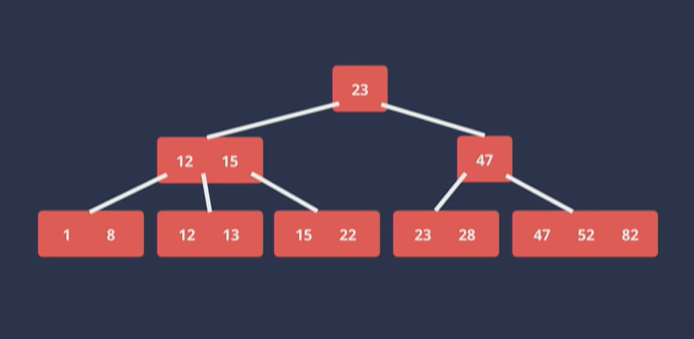
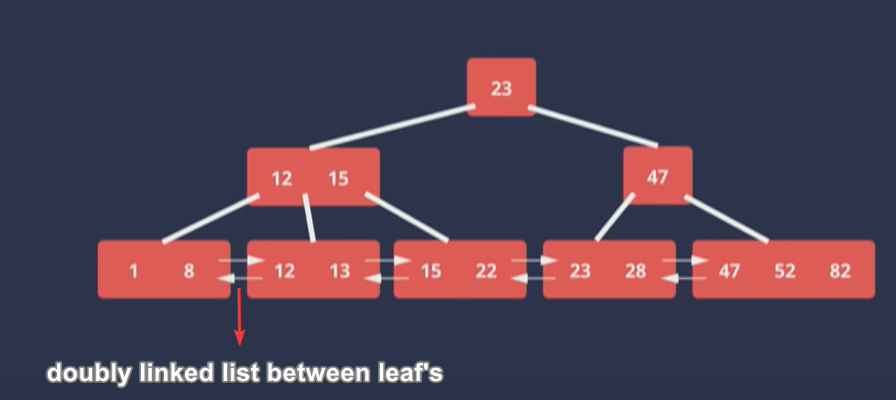
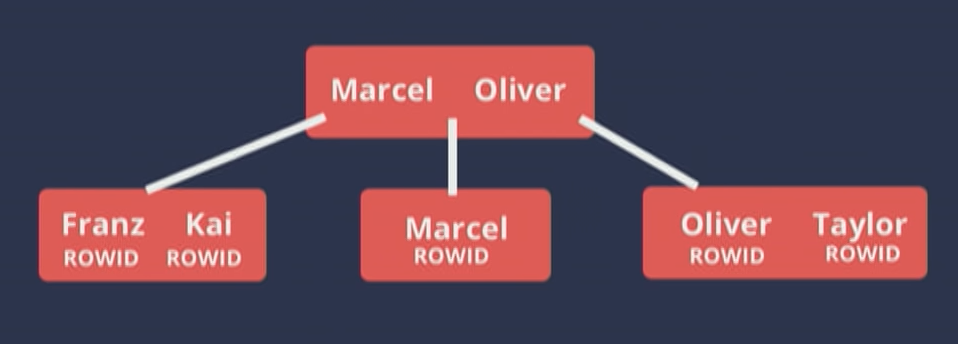
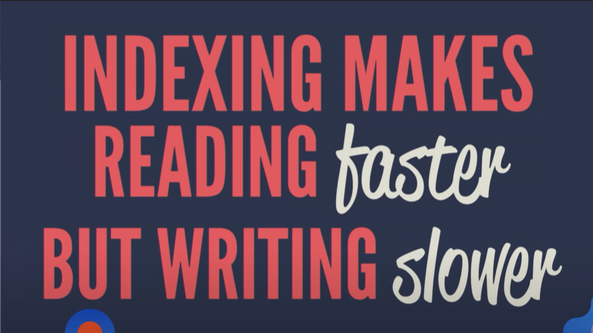
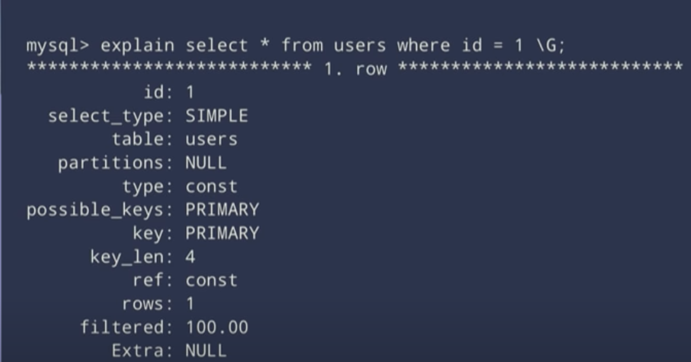
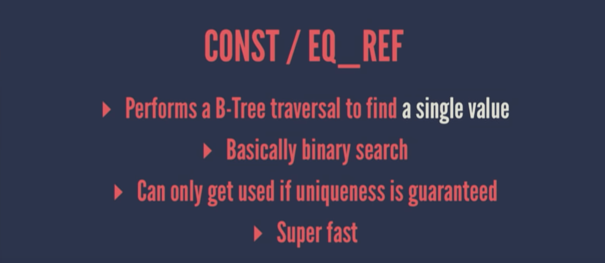
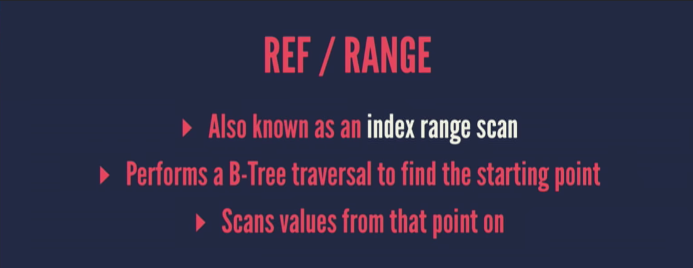
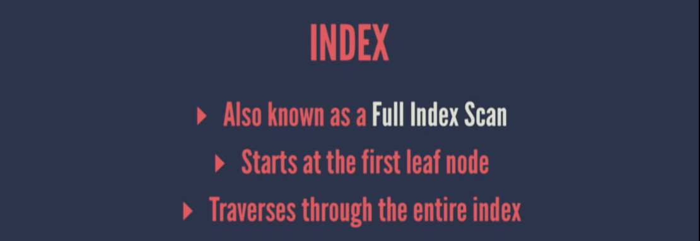
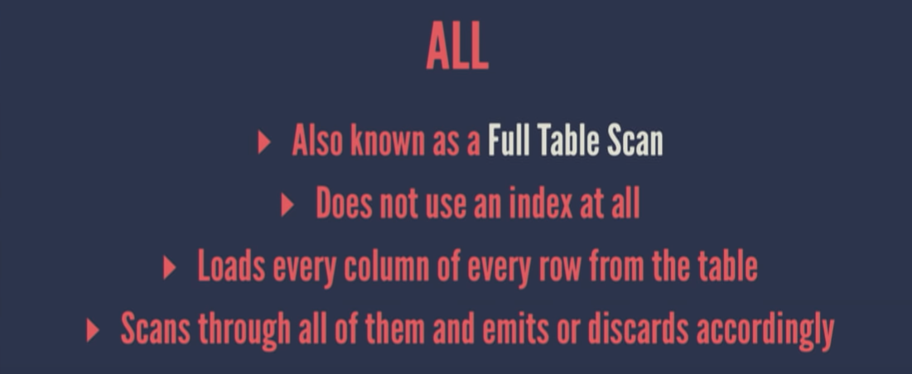

# Things every developer absolutely, positively needs to know about database indexing

[Link to Tech Talk](https://www.youtube.com/watch?v=HubezKbFL7E)

An index is an **ordered** representaiton of indexed data, ordering is important as it is much faster than searching an unordered input, think about binary search.

> As a rule of thumb create as many Indices as **necessary** but as few as **possible** - Kai Sassnowski

## What is a B-Tree

B-Tree is a balanced tree, meaning it has the same number of hierachial nodes on each side of the split, the **leaf nodes will always be on the same level**. So traversing a B-tree should take the same amount of time regardless of the branch we take

_Note : how the numbers are ordered in the image below_

_Note : how the the leaves are doubly linked, this is improve performance, or else each leaf would have to go back to the leaf node and then go back to each leaf_

> B-Tree is a self-balancing search tree. In most of the other self-balancing search trees (like AVL and Red-Black Trees), it is assumed that everything is in main memory. To understand the use of B-Trees, we must think of the huge amount of data that cannot fit in main memory. When the number of keys is high, the data is read from disk in the form of blocks. Disk access time is very high compared to the main memory access time. The main idea of using B-Trees is to reduce the number of disk accesses. Most of the tree operations (search, insert, delete, max, min, ..etc ) require O(h) disk accesses where h is the height of the tree. B-tree is a fat tree. The height of B-Trees is kept low by putting maximum possible keys in a B-Tree node. Generally, the B-Tree node size is kept equal to the disk block size. Since the height of the B-tree is low so total disk accesses for most of the operations are reduced significantly compared to balanced Binary Search Trees like AVL Tree, Red-Black Tree, ..etc.

More on [b-trees](https://www.geeksforgeeks.org/introduction-of-b-tree-2/)

## What gets stored in an index

Consider the table which has an index on the `name` column

the index would look something like this, where the keys to the index are the ROWID not the primary key

Benefits

- Seach for a value is fast in logirathamic scalability, meaning the increase in input will not be a problem to the index.

## Cost of an Index

The tree will have to re-balanced on each and every DML query to the table.

## Understanding the execution Plan

Steps the db engine needs to perfrom to execute the query.

_A sample query plan_

### Rows

The number of estimated rows the index/table will have to traverse to get the result

### Type

or Join type is just really actually the access type the query is going to use to access the data in the table.

Possible values being

- Const/EQ_REF
If you see thig stop optimizing, there is nothing much you can do.

- REF/RANGE
Works on a subset of the index, finds a starting point and then traverses from that point on till it meets the end clause.

- INDEX
Still hits the index a little bit faster than a full table scan

- ALL
AVOID AT ALL COSTS !!!

### Possible Keys

The indexes the query planned had considered before executing the query

### Keys

The indexes the query used to execute the query

### Extras

Specifies additional information in relation to the `types` column, usually indiciates if the query used only the indexes/table in the where clause.

## Common Pitfalls of indexes

- **Column Order Matters** [Jump to Video](https://youtu.be/HubezKbFL7E?t=2014)
  With multi column indexes, the column order matters as MCIs are evaluated from the left to the right.
  Consider the index table below
  
  As you can see the index is sorted first by the created at, then the total and finally the user id, if you were to add the user id to the where clause, this would still have to scan the entire index as the user id is the last, so the sorting order of the created at, total would take precedence after which the user id would be evaluated.
- **Functions** [Jump to Video](https://youtu.be/HubezKbFL7E?t=1248)
  Queries which use functions in the where clause will completely ignore the index, even if one is in place and trying to force use the index will make the queries even slower, always trust the query planner.
- **Inqeuality Operators** [Jump to Video](https://youtu.be/HubezKbFL7E?t=2166)
  An index traverses from left to right in multi column indices but as soon as it encounters an inequality operator in the equery it just stops and all the other indexes are just redundant at this point.
  _Tip_ : In SQL between is also an inequality operator.

## Moral of the Talk

Index is a developer concern not a database expert query, it has to always has the queries it will impact as the guiding principle and context.

## Definitions

Index only scans
: Where a query only hits the indexes
