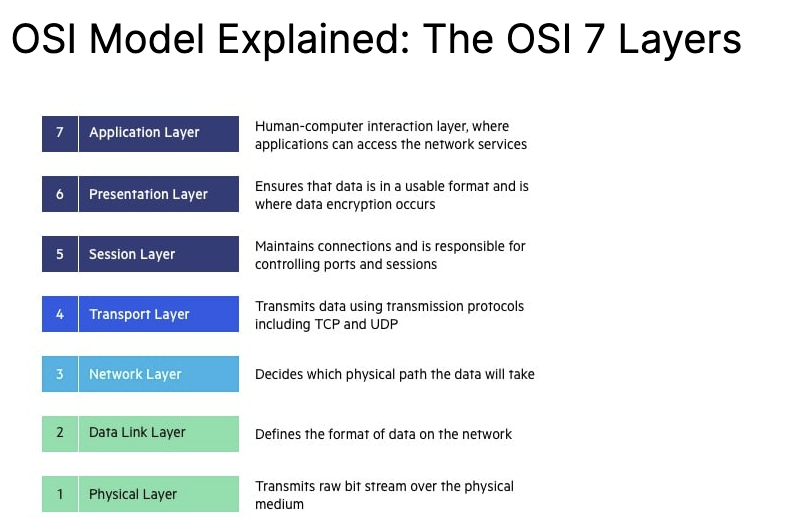

# Networking for Software Engineers

📺 Youtube [Playlist](https://www.youtube.com/playlist?list=PLaqbJZ1ZdlRFnH1Ys-7tPPAY_D8HImkg_)

## OSI Model

📺 [Video](https://www.youtube.com/watch?v=7IS7gigunyI)

The Open Systems Interconnection (OSI) model describes seven layers that computer systems use to communicate over a network. It was the first standard model for network communications, adopted by all major computer and telecommunication companies in the early 1980s

The modern Internet is not based on OSI, but on the simpler TCP/IP model. However, the OSI 7-layer model is still widely used, as it helps visualize and communicate how networks operate, and helps isolate and troubleshoot networking problems.

[Read more here](https://www.imperva.com/learn/application-security/osi-model/) and [here](https://www.forcepoint.com/cyber-edu/osi-model)

## What is TCP ?

📺 [Video](https://www.youtube.com/watch?v=qqRYkcta6IE)

The TCP is the layer 4 Transport protocol in the OSI model. TCP stands for Transport Control Protocol. In essence the sender and receiver know who each other are using IP (Internet Protocol), so it is more secure.

TCP stands for Transmission Control Protocol a communications standard that enables application programs and computing devices to exchange messages over a network. It is designed to send packets across the internet and ensure the successful delivery of data and messages over networks.

TCP is one of the basic standards that define the rules of the internet and is included within the standards defined by the Internet Engineering Task Force (IETF). It is one of the most commonly used protocols within digital network communications and ensures end-to-end data delivery.

TCP organizes data so that it can be transmitted between a server and a client. It guarantees the integrity of the data being communicated over a network. Before it transmits data, TCP establishes a connection between a source and its destination, which it ensures remains live until communication begins. It then breaks large amounts of data into smaller packets, while ensuring data integrity is in place throughout the process.

As a result, high-level protocols that need to transmit data all use TCP Protocol.  Examples include peer-to-peer sharing methods like [File Transfer Protocol (FTP)](https://www.fortinet.com/resources/cyberglossary/file-transfer-protocol-ftp-meaning), Secure Shell (SSH), and Telnet. It is also used to send and receive email through Internet Message Access Protocol (IMAP), Post Office Protocol (POP), and Simple Mail Transfer Protocol (SMTP), and for web access through the [Hypertext Transfer Protocol (HTTP)](https://www.fortinet.com/resources/cyberglossary/what-is-https).

| Pros | Cons |
| --- | --- |
| Acknowledgement | Larger Packets |
| Guaranteed delivery | More bandwidth |
| Connection based | Slower than UDP |
| Congestion control | Stateful |
| Ordered packets | Server memory (DOS) reserved to make the connection stateful |

## What is UDP ?

📺 [Video](https://www.youtube.com/watch?v=qqRYkcta6IE)

User Datagram Protocol (UDP) refers to a protocol used for communication throughout the internet. It is specifically chosen for time-sensitive applications like gaming, playing videos, or Domain Name System (DNS) lookups. UDP results in speedier communication because it does not spend time forming a firm connection with the destination before transferring the data. Because establishing the connection takes time, eliminating this step results in faster data transfer speeds.

🧪 However, UDP can also cause data packets to get lost as they go from the source to the destination. It can also make it relatively easy for a hacker to execute a distributed denial-of-service (DDoS) attack.

In many cases, particularly with Transmission Control Protocol (TCP), when data is transferred across the internet, it not only has to be sent from the destination but also the receiving end has to signal that it is ready for the data to arrive. Once both of these aspects of the communication are fulfilled, the transmission can begin. However, with UDP, the data is sent before a connection has been firmly established. This can result in problems with the data transfer, and it also presents an opportunity for hackers who seek to execute DDoS attacks.

## **How Does UDP Work?**

In comparison to other networking protocols, the process behind UDP is fairly simple. A target computer is identified and the data packets, called “datagrams,” are sent to it. There is nothing in place to indicate the order in which the packets should arrive. There is also no process for checking if the datagrams reached the destination.

Even though UDP comes with checksums, which are meant to ensure the integrity of the data, and port numbers, which help differentiate the role the data plays at the source and destination, the lack of an obligatory handshake presents a problem. The program the user is executing with the help of UDP is left exposed to unreliable facets of the underlying network.

As a result, the data may get delivered, and it may not. In addition, the order in which it arrives is not controlled, as it is in TCP, so the way the data appears at the final destination may be glitchy, out of order, or have blank spots.

However, in a situation where there is no need to check for errors or correct the data that has been sent, this may not pose a significant problem. This is one reason why UDP is used in video applications. Getting the video signal to its destination on time is worth the occasional glitches.

Read more from [here](https://www.fortinet.com/resources/cyberglossary/user-datagram-protocol-udp)

| Pros | Cons |
| --- | --- |
| Smaller Packets | No Acknowledgement |
| Less bandwidth | No Guaranteed delivery |
| Faster than TCP | No Congestion control |
| Stateless | Connectionless |
|  | No Ordered packets |
|  | Less Security |

## What is TLS ?

📺 [Youtube Video](https://www.youtube.com/watch?v=AlE5X1NlHgg)

Transport Layer Security, or TLS, is a widely adopted security [protocol](https://www.cloudflare.com/learning/network-layer/what-is-a-protocol/)
 designed to facilitate privacy and data security for communications over the Internet. A primary use case of TLS is encrypting the communication between web applications and servers, such as web browsers loading a website. TLS can also be used to encrypt other communications such as email, messaging, and voice over IP (VoIP). In this article we will focus on the role of TLS in [web application security](https://www.cloudflare.com/learning/security/what-is-web-application-security/).

### Data sent with HTTP and HTTPs

HTTP request High level

HTTPs request High level

### TLS Vs SSL

TLS evolved from a previous encryption protocol called Secure Sockets Layer ([SSL](https://www.cloudflare.com/learning/ssl/what-is-ssl/)), which was developed by Netscape. TLS version 1.0 actually began development as SSL version 3.1, but the name of the protocol was changed before publication in order to indicate that it was no longer associated with Netscape. Because of this history, the terms TLS and SSL are sometimes used interchangeably

### **What is the difference between TLS and HTTPS?**

[HTTPS](https://www.cloudflare.com/learning/ssl/what-is-https/) is an implementation of TLS encryption on top of the [HTTP](https://www.cloudflare.com/learning/ddos/glossary/hypertext-transfer-protocol-http/) protocol, which is used by all websites as well as some other web services. Any website that uses HTTPS is therefore employing TLS encryption.

### **What does TLS do?**

There are three main components to what the TLS protocol accomplishes: [Encryption](https://www.cloudflare.com/learning/ssl/what-is-encryption/), Authentication, and Integrity.

- **Encryption:** hides the data being transferred from third parties.
- **Authentication:** ensures that the parties exchanging information are who they claim to be.
- **Integrity:** verifies that the data has not been forged or tampered with.

### **How does TLS work?**

For a website or application to use TLS, it must have a TLS certificate installed on its [origin server](https://www.cloudflare.com/learning/cdn/glossary/origin-server/) (the certificate is also known as an "[SSL certificate](https://www.cloudflare.com/learning/ssl/what-is-an-ssl-certificate/)" because of the naming confusion described above). A TLS certificate is issued by a certificate authority to the person or business that owns a domain. The certificate contains important information about who owns the domain, along with the server's public key, both of which are important for validating the server's identity.

A TLS connection is initiated using a sequence known as the [TLS handshake](https://www.cloudflare.com/learning/ssl/what-happens-in-a-tls-handshake/). When a user navigates to a website that uses TLS, the TLS handshake begins between the user's device (also known as the *client* device) and the web server.

During the TLS handshake, the user's device and the web server:

- Specify which version of TLS (TLS 1.0, 1.2, 1.3, etc.) they will use
- Decide on which cipher suites (see below) they will use
- Authenticate the identity of the server using the server's TLS certificate
- Generate session keys for encrypting messages between them after the handshake is complete

### **How does TLS affect web application performance?**

The latest versions of TLS hardly impact web application performance at all.

Because of the complex process involved in setting up a TLS connection, some load time and computational power must be expended. The [client and server](https://www.cloudflare.com/learning/serverless/glossary/client-side-vs-server-side/) must communicate back and forth several times before any data is transmitted, and that eats up precious milliseconds of load times for web applications, as well as some memory for both the client and the server.

However, there are technologies in place that help to mitigate potential [latency](https://www.cloudflare.com/learning/performance/glossary/what-is-latency/) created by the TLS handshake. One is TLS False Start, which lets the server and client start transmitting data before the TLS handshake is complete. Another technology to speed up TLS is TLS Session Resumption, which allows clients and servers that have previously communicated to use an abbreviated handshake.

These improvements have helped to make TLS a very fast protocol that should not noticeably affect [load times](https://www.cloudflare.com/learning/performance/why-site-speed-matters/). As for the computational costs associated with TLS, they are mostly negligible by today’s standards.

TLS 1.3, released in 2018, has made TLS even faster. TLS handshakes in TLS 1.3 only require one round trip (or back-and-forth communication) instead of two, shortening the process by a few milliseconds. When the user has connected to a website before, the TLS handshake has zero round trips, speeding it up still further.

### TLS 1.2

So basically TSL 1.2 was all about giving options to the client and the server to communicate with each other, so a client would list out all the hash, cryptography and key exchange protocol algorithms and the server would decide on an protocol and establish communication with the client and would also send the public key of the server which would be used by the client to encrypt the symmetric key to encrypt the information, and then **the client would use this key and generate the symmetric key and send it over the network to the server to use to decrypt** whatever the client encrypted.

The problem is that the key is sent over the network and the key exchange algorithm has 2 roundtrips which is very slow.

### TLS 1.3

Improves on TLS 1.2 but removes all the options and uses diffie helman or ephemeral diffi helman as the key exchange which is much faster and much secure.

### Diffie Helmen Key Exchange

Basically what this means that there is one public key which is shared by the sender and the receiver and then there are two private keys which reside in the sender and receiver, usually if you combine all three keys together you get the private key which is an algorithm, but at any given time over the network a combined values of the private and public keys is sent over the network which is then combined with the private key of the receiver to create the private key used to decrypt the content.

](images/Untitled%206.png)

[https://www.simplilearn.com/tutorials/cryptography-tutorial/deffie-hellman-key-exchange](https://www.simplilearn.com/tutorials/cryptography-tutorial/deffie-hellman-key-exchange)

## What is the TCP Handshake ?

📺 [Youtube Video](https://www.youtube.com/watch?v=bW_BILl7n0Y&list=PLaqbJZ1ZdlRFnH1Ys-7tPPAY_D8HImkg_&index=3&t=3s)

Typically for a client and a sever to communicate three things are required

- An open connection between client and server
- Packets sent between client and should be acknowledged the server
- The start sequence of the handshake should be acknowledged by the client and server and should be agreed upon so they know from where both know how the packets can be assembled or disassembled.

Okay so I type in [http://google.com](http://google.com) in the browser, how does the following happen

1. How does [google.com](http://google.com) get translated into a mapped ip address - Using DNS
2. How is a connection established between the client and the server to send back the website ?
3. Since the website at its lowest level is a collection of packets, how does the server let the client know what is the order the packets which should be assembled to make sense and how does the client know what is the starting point of the server packet.
4. How does the server know if the client has received all the packets ?
5. How does the client know that the server has sent all the information and it does not need to wait ?

High level overview of Client/ Server Communication

![High level overview of how a tcp handshake works, the client sends packets and the server will have to acknowledge the packets it has received or else the client will keep resending these packets till it gets an acknowledgement from the server. The acknowledgement is not a  response, what is still missing from this is that how does the server know that the sequence of packets starts from 100. We don’t always start with zero for security reasons, sniffers can replay the requests and might be able to re-assemble a request](images/Untitled%208.png)

High level overview of how a tcp handshake works, the client sends packets and the server will have to acknowledge the packets it has received or else the client will keep resending these packets till it gets an acknowledgement from the server. The acknowledgement is not a  response, what is still missing from this is that how does the server know that the sequence of packets starts from 100. We don’t always start with zero for security reasons, sniffers can replay the requests and might be able to re-assemble a request

- **Step 1 (SYN):** In the first step, the client wants to establish a connection with a server, so it sends a segment with SYN(Synchronize Sequence Number) which informs the server that the client is likely to start communication and with what sequence number it starts segments with
- **Step 2 (SYN + ACK):** Server responds to the client request with SYN-ACK signal bits set. Acknowledgement(ACK) signifies the response of the segment it received and SYN signifies with what sequence number it is likely to start the segments with
- **Step 3 (ACK):** In the final part client acknowledges the response of the server and they both establish a reliable connection with which they will start the actual data transfer

    

[https://www.sciencedirect.com/topics/computer-science/three-way-handshake](https://www.sciencedirect.com/topics/computer-science/three-way-handshake)

## What are SSL/TLS Certificates ?

📺 [Video on SSL Certificates](https://www.youtube.com/watch?v=r1nJT63BFQ0) , [How HTTPs Works](https://www.youtube.com/watch?v=T4Df5_cojAs)

So When our keys are sent over the network for the key exchange algorithm how do we know that the keys sent have the intended sender and the receiver, how do we know that our key was not swapped by a man in the middle. We solve this using SSL certificates.

TLS/SSL certificates are used to protect both the end users’ information while it’s in transfer, and to authenticate the website’s organisation identity to ensure users are interacting with legitimate website owners.

## **THE TLS/SSL HANDSHAKE PROCESS**

1. Each TLS certificate consists of a key pair made of a public key and private key.These keys are important because they interact behind the scenes during website transactions.
2. Every time you visit a website, the client server and web browser communicate to ensure there is a secure TLS/SSL encrypted connection.
3. When a web browser (or client) directs to a secured website, the website server shares its TLS/SSL certificate and its public key with the client to establish a secure connection and a unique session key.
4. The browser confirms that it recognises and trusts the issuer, or Certificate Authority, of the SSL certificate—in this case DigiCert. The browser also checks to ensure the TLS/SSL certificate is unexpired, unrevoked, and that it can be trusted.
5. The browser sends back a symmetric session key and the server decrypts the symmetric session key using its private key. The server then sends back an acknowledgement encrypted with the session key to start the encrypted session.
6. Server and browser now encrypt all transmitted data with the session key. They begin a secure session that protects message privacy, message integrity, and server security.

