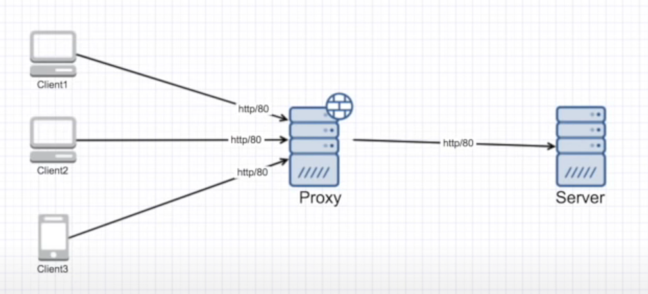
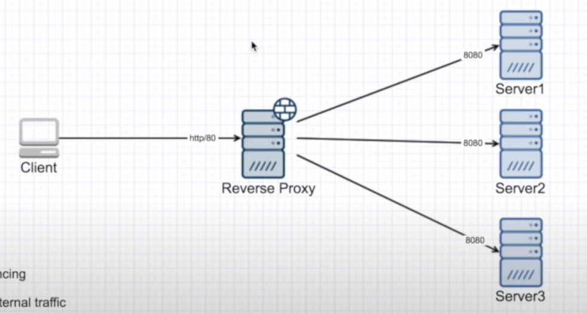

# Proxy vs Reverse Proxy

## Proxy

Proxies hide the identity of the client, the responding server has no idea who requested the resource because the request is routed through a proxy which makes the request on behalf of the client.

### Examples

- ISP use to block, cache and monitor traffic

### Benefits

- Anonymity
- Caching
- Blocking unwanted sites
- GeoFencing

## Reverse Proxy

Reverse proxies hide the client, the client does not know who the responding server is, ideally used in loadbalancing situations, API gateways etc ...

### Examples

- Load Balancing servers
- API Gateways
- Edge Microservices

### Benefits

- Load Balancing
- Caching
- Isolating internal traffic : Can create a DMZ past the reverse proxy and can hide ports and IPS from external web
- Logging
- Canary Deployment : One server can host a much newer version of the application and rollout features to a small userbase.

## References

[Proxy vs. Reverse Proxy (Explained by Example)- Hussain Nasser](https://www.youtube.com/watch?v=ozhe__GdWC8)
[Forward proxy vs reverse proxy difference explained - Brain Bytes (Java Brains)]([https://link](https://www.youtube.com/watch?v=AuINJdBPf8I))
