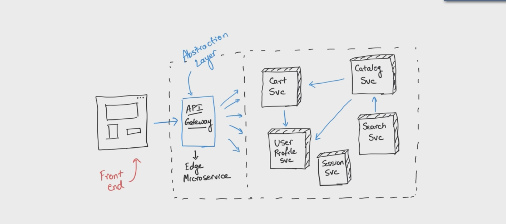
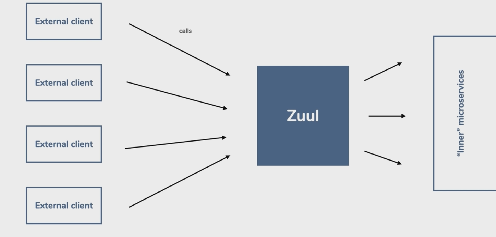
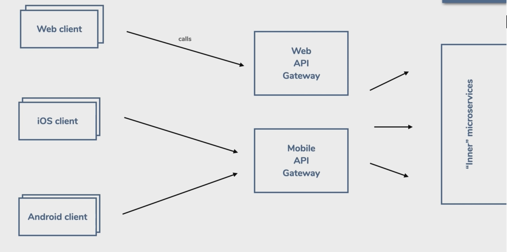

# Key concepts in microservices

## Terms

CSD : Client side discovery

SSD : Server side discovery

LB : Load Balancer

## Service Discovery

Microservices should be discoverable by clients that depend on it, change of ip address should not be reason why our microservice fails. For a service to be discoverable each client needs to register with the service discovery service.

Service Discovery servers also doubles as a load balancer.

### Client Side Discovery

The client does all the work to find the server, requesting from the address from the discovery server
and then making the call to the server.

Example of aCSD Server is Eureka.

### Server Side Discovery

The server does all the work here including acting as a proxy between the client and the server, which doesn't need to know about each other, and the additional server call is skipped when comparing to a CSD.

NGINX or AWS

## API Gateway

[What is API gateway really about ? Java Brains]([https://link](https://www.youtube.com/watch?v=1vjOv_f9L8I))

An API gateway is an abstraction layer takes all API calls from clients, then routes them to the appropriate microservice with request routing, composition, and protocol translation. Typically it handles a request by invoking multiple microservices and aggregating the results, to determine the best path. It can translate between web protocols and web‑unfriendly protocols that are used internally.

### The Role of API Gateways in Microservices Architectures

An API gateway is the conductor that organizes the requests being processed by the microservices architecture to create a simplified experience for the user. It’s a translator, taking a client’s many requests and turning them into just one, to reduce the number of round trips between the client and application. An API gateway is set up in front of the microservices and becomes the entry point for every new request being executed by the app. It simplifies both the client implementations and the microservices app.

### API gateways are core infrastructure

Think of an API gateway platform as an application server, but for APIs. It is seen as the API runtime environment, and provides these core services:

- API security
- API protocol connectivity
- API virtualization
- API Scalability and elasticity
- High availability
- Manageability
- Development simplicity

Since the core API infrastructure is provided, developers can focus on providing the application logic, and no longer need to build these services into their application.

Netflix ZUUL is an implementation of an API Gateway

### Disadvantages of API Gateways

- They add to the network hops which consequently has latency sufferage.

- They can get a bit complicated when we have BFF patterns for different consumers like web, mobile and have to routing mechanisms and load balancing

