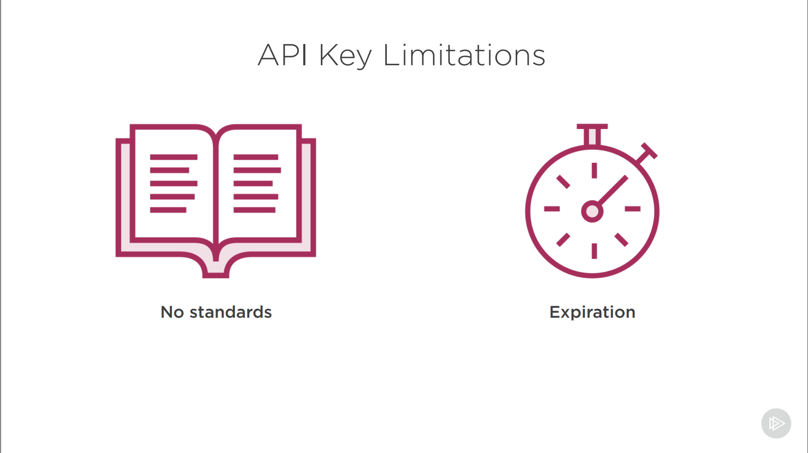

# Getting Started with OAuth 2.0

## Author

Scotty Brady

## Course url

<https://app.pluralsight.com/library/courses/oauth-2-getting-started/table-of-contents>

## 1. API Security 101

Say we have to authorize an API to send a mail on behalf of a user, there are many ways achieve this as given below

- [Credential Sharing](#credential-sharing)
- [Cookies](#cookies)
- [API keys](#api-keys)
- [OAuth 2.0](#oauth-20)

### Credential Sharing

Is the process of asking the users to re-enter their login belonging to a service in a third-party app which requires permission to do an action on behalf of the user, in our case send an email.

However there is a host of problems with this approach.

- We are no longer delegating access, instead the client application is impersonating the user.his means that there is no scoped access, the application can do anything the user can. So instead of just being able to send emails, it can now delete them, create new contacts, change the user’s details, whatever it wants. This is a little more forgivable when all applications are within a single security domain (e.g. an intranet), but it’s still asking for trouble.

- Revocation is also an issue, as this would involve the user changing their credentials for their entire account, instead of just this client application, which would also affect any other application using this technique and, let’s face it, the user is probably using this password for many other accounts.

- We’re also unnecessarily exposing user credentials to the client application. Not only is this increasing the attack surface for our protected resource, but the client must store the user credentials in a reversible format so that they can later be relayed to our protected resource. As we know, passwords should be stored using a password hashing algorithm and never be stored in a reversible format (pain text or encrypted).

- This also brings challenges to systems using multiple factors for authentication, as the authentication method used must have a constant value so that it can be stored and repeated at a later date. This means secure factors such as “something you have” using a local token generator such as Google Authenticator cannot be used.

- Federated identity is also not an option unless they support credential sharing (unlikely), so it’s local accounts or nothing.

- Yet another limitation is with native or client side applications, which might not have a mechanism for storing credentials with any semblance of security, and therefore cannot use credential sharing without putting users at risk.

### Cookies

Yes, cookies protecting APIs is unfortunately still a thing. Whether it’s the protected resource sharing the same cookie as the client application, or prompting the user to log into the protected resource before in order to use it as seen above.

So, you log into your API and get a cookie. Great, now the client application can make requests. But if you open another tab in your browser and make a request manually to the API, you will still be successful. The problem here is that we are no longer authorizing the application to access our API, instead we are authorizing the browser. This opens up a world of pain in the form of Cross Site Request Forgery (CSRF or XSRF), where other applications will happily start using your API without your permission. Not good.

We also do not have much of a revocation path, as now we’d need to invalidate a cookie stored in a user’s browser by either waiting for them to make another request, or by changing our keys used to protect the cookie, invalidating every cookie for that protected resource.

I’m sure there are hacks around some of these issues, but the point still stands, cookies for APIs is a bad idea as they will always be open to CSRF.

### API keys

A common solution is to have your protected resource generate a key for the user. This would typically be generated by the user within the protected resource. This could be a single API key or a mechanism that allows the user to generate keys. Out of the box this gives us removes a few of the downsides of credential sharing, we’re no longer exposing the user’s credentials, our API authorization method no longer affects what authentication methods we can use (both factors and external identity providers).

A key per client application is certainly more desirable, and using this mechanism you can start to address other concerns by building out the logic:

- Scoped Access (maybe configurable by the user on key generation)
- Key Revocation (assuming on key per app, we can revoke keys safely)

However, this approach still has its limitations. The credentials are still not explicitly linked to the client application, there’s no guarantee that the request using this API key came from the application it was generated for. Whilst this can also be true for bearer tokens used in OAuth, an API key has no expiration, meaning that until you discover it has been compromised and manually revoke it (assuming you built a revocation mechanism) the attacker has free reign over your system.

Assuming the client application is already aware of the protected resource, then we are also unnecessarily **exposing the user to client credentials** and forcing them to manage them. We already know how lazy we get with username and passwords; do you trust that API keys will be treated any differently? This has the potential for keys to be shared, making them harder to revoke, and relies on the user to know what permissions the client resource requires.

There’s a lot of **custom code and architecture** involved in getting this approach right, and even then, it has fundamental vulnerabilities. Based on how many failed implementations of OAuth there are, do you really think you’ll be able to both reinvent all of this logic and then implement it within this decade?

Another option that is very similar to the API Key method, is to create a user account specifically for the client application.

### OAuth 2.0

Is a token based authorization framework, built for HTTP APIs to grant scoped access using a delegation protocol to ensure that authorization for the only the protected resource , this solves almost all the problems with the above discussed solutions for granting Access to protected resource.

For OAuth 2.0 to work it needs the players who orchestrate the autorization dance as shown below

When the players are in place they get ready to do the OAuth dance.

The first step in this dance is

1. When the **Client Application** ask a Resource owner (the user who owns the data in the protected resouce, in our case to send the email) for Authentication and Consent

2. This takes them to Authoization server endpoint which gives the the login page of the application where the protected resource is in with a particular grant type, when the user has authenticated themselves

3. They then shown the protected resource the Client Application is requesting Access to, and the user can at decide if they wish to allow or reject this

4. If the user has consented to grant access , they client application gets an Authorization Grant in the browser. Then in the server a back-channel request is triggered to the Authorization Server to swap the authorization code with the authorization token

5. Finally this token is used to access the HTTP APIs which can now delegate actions on behalf of the user.

### Misconception with Auth 2.0

OAuth got a lot of things right, but left a lot open to interpretation, therefor misuse. There are a few misconceptions about OAuth 2.0 which has led to it getting a bad rep.

1. OAuth is not an Authentication framework, but just a authorization protocol, other protocols built on top of OAuth like OpenID Connect support Authentication. The reason is simple, Access token do not represent the user, they just represent a consent for a resouce owner, the token cannot be used reverse engineer the user information like username or password.

2. OAuth is too abstract , it did not outright define things like
    - How an access token looked light
    - How to validate access tokens
    - Since it was too abstract a lot of implementations propped up with varying quality

But most of the problems seems to stem from the understanding by the Authorization provider, it solved what it was created to solve very right .

## 2. OAuth in Detail

## 3. Best Practices for Native Applications

## 4. Best Practices for Browser-based Applications

## 5. Extending OAuth

### OpenId Connect Protocol

When it come

