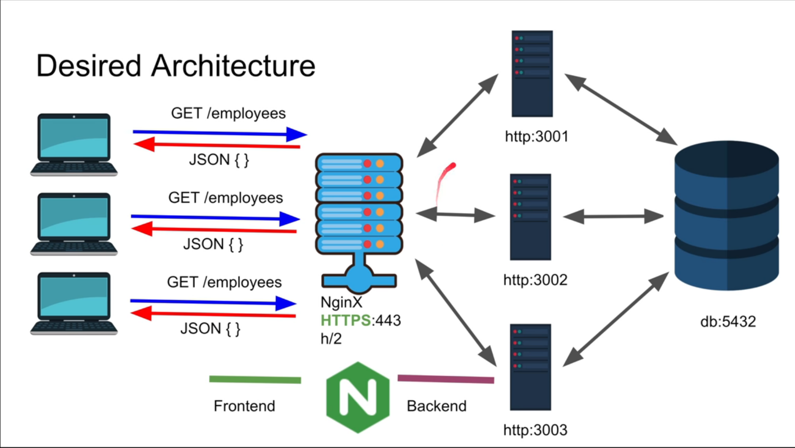

# What is Nginx

Nginx is a server which can act both as a web server and a proxy

- Web Server
  - Serves web content
- Proxy
  - Can act as a reverse proxy
  - Load Balancing
  - Backend Routing
  - Caching

## What problem does Nginx solve

